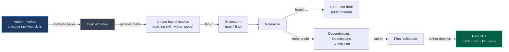
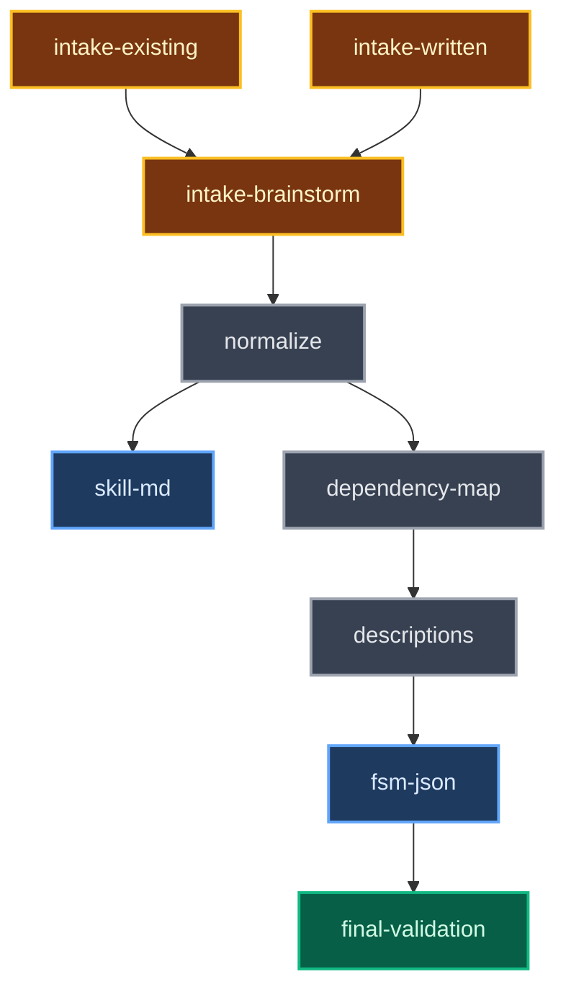

## Context

The finite-skill-machine (FSM) plugin enables skills to define structured task workflows via a SKILL.md + fsm.json companion pair. When a skill is invoked, the `hydrate-tasks.py` PostToolUse hook reads the fsm.json, translates local IDs to session-scoped IDs, and writes task files to `~/.claude/tasks/{session_id}/`. A PreToolUse guard prevents the agent from reading SKILL.md or fsm.json directly — after hydration, the task descriptions become the sole instruction source as the original skill text is compacted away.

Creating FSM-enabled skills currently requires reverse-engineering this structure from validation code and existing examples. Authors must manually construct dependency graphs, ensure each task description is self-contained enough to survive context compaction, and avoid leaking internal mechanism terms into the SKILL.md. This skill (`finite-skill-machine:creating-taskflow-skills`) automates that authoring process through a guided multi-task workflow.

**This skill is itself an FSM skill**: it ships as a SKILL.md + fsm.json pair within the FSM plugin. Its tasks guide the author through creating a *new* SKILL.md + fsm.json pair for the author's own skill. The output artifacts follow the same format as the skill itself.

**Intake path handling**: fsm.json defines a static task list — it cannot conditionally activate tasks at runtime. The two input-based intake sources (existing skill, written steps) are modeled as parallel unblocked tasks. Brainstorming runs sequentially after them as a gap-filling step — it receives context from whatever material the input-based intakes produced and fills gaps from that material. The intake sources are not mutually exclusive — author input may span multiple sources (e.g., an existing skill plus brainstormed additions). The agent and author combine inputs through discussion; each intake task contributes whatever material applies, or marks itself complete if it has nothing to add. The dependency graph is `(IE|IW) → IB → N`: input-based intakes fan-in to brainstorming, which then feeds normalize.

**Prior decisions referenced**:
- fsm.json companion file approach for task definitions (from FSM technical spec)
- `{"fsm": "skill-name"}` metadata format for scoped deletion (from FSM anti-clobber change)
- PreToolUse guard blocking direct reads of SKILL.md and fsm.json (from FSM technical spec)
- INT-fsm-json schema: JSON array with id, subject, description, activeForm, status, blockedBy, blocks, metadata, owner fields (from FSM technical spec)

## Objectives

`OBJ-guided-authoring`: Author produces a valid SKILL.md + fsm.json pair for their new skill without needing to know FSM internals (hydration mechanics, hook system, task file schema, or ID translation)

`OBJ-self-contained-output`: Every task description generated by the skill stands alone as the sole instruction source after context compaction — no description depends on the original skill text, sibling task content, or external references

`OBJ-incremental-validation`: Phase-gate validation at each workflow step catches errors early (intake, normalization, dependency mapping, description writing), complemented by a comprehensive cross-cutting final validation pass before file generation

`OBJ-intake-convergence`: Two input-based intake sources (existing skill analysis, written step descriptions) feed into a brainstorming gap-filling step, then converge into a single normalized step list in a consistent format, enabling all downstream tasks to operate path-agnostically

## Architecture

### System overview

The skill itself is an FSM skill — when invoked, the hook hydrates tasks that guide the author through creating their own SKILL.md + fsm.json pair. The output artifacts (rightmost node) follow the same INT-fsm-json schema and SKILL.md conventions that this skill itself uses.

### Task dependency graph

The following flowchart (this skill's task dependency graph, not the parent FSM hydration pipeline) is **authoritative** for task ordering and dependency structure.

- **CMP-intake-existing, CMP-intake-written**: Parallel input-based intake (both unblocked, both block CMP-intake-brainstorm). Two non-exclusive intake sources — each task contributes whatever material applies from the author's input, or marks itself complete if it has nothing to add. Author input may span multiple sources.
- **CMP-intake-brainstorm**: Sequential gap-filling step (blocked by CMP-intake-existing and CMP-intake-written, blocks CMP-normalize). Receives context from whatever material the input-based intakes produced and fills gaps — generating ideas for missing areas, expanding thin coverage, or producing the full step list from scratch if neither input-based intake contributed material. Not a parallel source; runs after input-based intakes complete.
- **CMP-normalize**: Blocked by CMP-intake-brainstorm. Normalizes whichever intake sources produced output into a consistent step list format.
- **CMP-skill-md**: Branches off CMP-normalize independently. Only needs the normalized step list to write author-facing documentation about broad workflow concepts. Self-validates (frontmatter check) and completes independently — does not feed into CMP-final-validation.
- **CMP-dependency-map → CMP-descriptions → CMP-fsm-json-finalize**: Linear chain. Dependency mapping → self-contained description writing → fsm.json finalization. Progressive construction flows linearly through these three components.
- **CMP-final-validation**: Depends on CMP-fsm-json-finalize only. Cross-cutting validation runs after the fsm.json artifact is finalized. Does not wait for CMP-skill-md (which self-validates independently).

### Data flow

| Phase | Component | Output artifact | Format |
|-------|-----------|----------------|--------|
| Intake (existing skill) | CMP-intake-existing | Raw workflow material or skip | Extracted steps with labels and descriptions from the existing skill's structure |
| Intake (written steps) | CMP-intake-written | Raw workflow material or skip | Authored step descriptions as provided by the author |
| Intake (brainstorming — gap-filling) | CMP-intake-brainstorm | Gap-filling material, full step list, or skip | Additional steps filling gaps from prior intake material, or a full brainstormed step sequence if no prior material exists |
| Normalization | CMP-normalize | Normalized step list | Numbered list of `{label, description}` pairs — consistent format regardless of intake path |
| Dependency mapping | CMP-dependency-map | Dependency table | Table of `{task_id, task_label, blockedBy[]}` entries showing serial, parallel, fan-in, and fan-out relationships |
| Description writing | CMP-descriptions | Enriched task list | List of `{task_id, task_label, description, activeForm}` entries — each description is self-contained |
| SKILL.md generation | CMP-skill-md | SKILL.md (final, self-validated) | Markdown with YAML frontmatter (`name`, `description`) and body content in author-facing language — self-validated for frontmatter correctness |
| fsm.json finalization | CMP-fsm-json-finalize | fsm.json (final) | JSON array following INT-fsm-json schema: `{id, subject, description, activeForm, blockedBy}` per entry — validated and formatted from progressively-built artifact |
| Final validation | CMP-final-validation | Validation report | Pass/fail results for 3 cross-cutting checks with specific issues listed per failure |

## Specifications

*No active specifications. SPEC-prohibited-terms was removed per GAP-120 — automated prohibited term scanning was replaced by author judgment during SKILL.md writing.*

## Components

`CMP-intake-existing`: Existing skill intake
- **Description**: One of two parallel input-based intake sources. Handles the case where the author provides an existing skill to transform into an FSM workflow. If the author's input does not include an existing skill, this task has nothing to contribute and should be marked complete immediately. Output flows to CMP-intake-brainstorm (gap-filling step), not directly to CMP-normalize.
- **Applicability criteria**: The author's input includes or references an existing skill file, skill directory, or functioning skill to be restructured.
- **Responsibilities**:
  - Evaluate whether the author's input includes material for this source; if so, contribute applicable material and get author confirmation before proceeding
  - If not applicable: mark task complete with no output
  - If applicable: analyze the existing skill's structure and extract discrete workflow steps
  - Extract sequential steps in the order they appear in the original skill
  - Identify implicit parallelism where independent operations have no data dependencies
  - When the existing skill contains conditional logic (if/else paths, conditional branches), guide the author to decompose them — either as separate tasks with the condition stated in each task's description, or as a single task that handles both branches internally. The author chooses the decomposition strategy
  - Present extracted steps for author review — author can confirm, add, remove, reorder, or rename steps
  - Validate that at least one step emerges from the extraction; if zero steps emerge, mark task complete with no output (CMP-intake-brainstorm handles the empty-input case)
- **Dependencies**: None (unblocked intake task)

`CMP-intake-written`: Written steps intake
- **Description**: One of two parallel input-based intake sources. Handles the case where the author provides written step-by-step descriptions of their intended workflow. If the author's input does not include written step descriptions, this task has nothing to contribute and should be marked complete immediately. Output flows to CMP-intake-brainstorm (gap-filling step), not directly to CMP-normalize.
- **Applicability criteria**: The author's input is a set of step-by-step descriptions, an ordered list of actions, or a written outline of workflow phases.
- **Responsibilities**:
  - Evaluate whether the author's input includes material for this source; if so, contribute applicable material and get author confirmation before proceeding
  - If not applicable: mark task complete with no output
  - If applicable: evaluate each description for specificity, actionability, and appropriate scope
  - Accept well-structured descriptions with at most minor formatting adjustments
  - Prompt for clarification on vague descriptions that lack specificity about what work is performed
  - Suggest splitting overly broad steps that encompass multiple distinct operations, with specific boundary recommendations
  - Validate that at least one step emerges from the intake; if zero steps emerge, mark task complete with no output (CMP-intake-brainstorm handles the empty-input case)
  - Preserve dependency hints embedded in descriptions as-is (e.g., "after the config is generated, validate it"). These hints are not acted on during intake — they are preserved in the step descriptions and inform CMP-dependency-map during the dependency mapping phase
- **Dependencies**: None (unblocked intake task)

`CMP-intake-brainstorm`: Brainstorming intake (gap-filling)
- **Description**: Sequential gap-filling step that runs after the two input-based intakes (CMP-intake-existing, CMP-intake-written) complete. Receives context from whatever material those intakes produced and fills gaps — generating ideas for missing areas, expanding thin coverage, or producing the full step list from scratch if neither input-based intake contributed material. This is not a parallel intake source; it is a sequential step that builds on prior intake output.
- **Responsibilities**:
  - Review the material contributed by the input-based intakes (existing skill, written steps) to understand what coverage exists
  - If prior intakes produced substantial material: identify gaps or thin areas in the step coverage and brainstorm additional steps to fill them; present proposed additions to the author for confirmation
  - If prior intakes produced no material (both marked complete with no output): guide the author through brainstorming a full step list from scratch — organize unordered ideas into a logical execution sequence, explaining the reasoning behind the proposed order
  - Consolidate overlapping ideas that describe the same or substantially similar work into single steps, explaining which ideas were merged and why
  - Present the proposed step list (additions or full list) to the author for confirmation — author can approve or request changes
  - Do not advance until the author approves the step list
  - Validate that at least one step exists (from prior intakes, this step, or both combined) before completing
  - If brainstorming yields no usable steps after the author declines to provide ideas and no prior intake produced material, acknowledge the author is not ready to define a workflow and suggest returning later — terminate the workflow gracefully
- **Dependencies**: CMP-intake-existing, CMP-intake-written (blocked by both input-based intakes)

`CMP-normalize`: Normalize into step list
- **Description**: Fan-in convergence point. Collects whatever workflow material exists and normalizes it into a consistent numbered step list format. Path-agnostic — operates on the available material without needing to know which intake path produced it. When multiple intake sources contribute material, CMP-normalize concatenates all contributions and presents the combined list to the author; no automatic deduplication is performed — the author resolves duplicates or conflicts during the confirmation step, since similar labels may serve different purposes. Includes an author confirmation gate — the skill does not advance until the author approves the normalized list.
- **Responsibilities**:
  - Collect whatever workflow material exists and normalize into step list format — concatenate all contributions from all intake sources without automatic deduplication
  - Transform the raw intake material into `{label, description}` pairs
  - Ensure every step has a short label and a description of the work it performs
  - Present the normalized step list to the author for confirmation
  - Incorporate author modifications (add, remove, reorder, rename steps)
  - Validate the normalized list: at least one step, no empty descriptions (CMP-intake-brainstorm guarantees at least one step exists before normalize runs, or terminates the workflow gracefully)
  - If validation fails within this task, present the issue to the author, ask them to correct it, then re-validate before completing the task
- **Dependencies**: CMP-intake-brainstorm (blocked by brainstorming, which itself depends on the two input-based intakes)

`CMP-dependency-map`: Map dependencies
- **Description**: Guides the author through encoding execution relationships between tasks. Covers serial chains, parallel groups, fan-in, fan-out, and diamond patterns. Includes an author review gate.
- **Responsibilities**:
  - Help the author express serial dependencies (task A blocks task B)
  - Identify tasks eligible for parallel execution (no mutual dependencies)
  - Encode fan-out (one predecessor, multiple independent successors) and fan-in (multiple predecessors, one successor) patterns
  - Present the complete dependency graph for author review
  - Allow the author to modify dependencies after review
  - Validate that every task appears in the graph and all dependency references point to existing tasks
  - Validate that no circular dependencies exist using Kahn's algorithm (BFS-based topological sort) via programmatic tool invocation (e.g., a Python script) rather than agent reasoning in natural language — deterministic execution ensures correct, repeatable cycle detection regardless of workflow complexity. Early detection prevents wasted effort on descriptions and file generation for a workflow that will fail final validation
  - Support step list modifications during the dependency mapping phase: the author MAY add, remove, or rename tasks. Each modification triggers a dependency graph update (removing dangling references on removal, prompting for new relationships on addition, preserving relationships on rename) and re-validation. Newly added tasks receive the next sequential ID (max existing ID + 1); existing task IDs remain stable during authoring. When the author adds a new task, apply a lightweight quality check against intake-quality criteria (specificity, actionability, scope) to the provided label and description before adding it to the graph — this prevents clearly under-specified tasks from entering the workflow without requiring full intake processing
  - If validation fails within this task, present the issue to the author, ask them to correct it, then re-validate before completing the task
  - When the workflow contains 15-20 or more tasks, warn the author that the workflow is large and suggest grouping related tasks for review during dependency mapping to improve UX. No hard upper limit is enforced
- **Dependencies**: CMP-normalize output (normalized step list)

`CMP-descriptions`: Write self-contained descriptions
- **Description**: Generates task descriptions from the intake understanding and presents drafts to the author for approval or editing. Each description must stand alone as the sole instruction source after context compaction. The authoring model is "skill generates, author approves/edits." Enforces self-containment rules, catches anti-patterns, and provides sizing guidance.
- **Responsibilities**:
  - Present tasks one at a time in dependency order (topological sort) during the description writing phase; the author can request to skip to a specific task or return to revise a previously completed one
  - Generate description drafts from the intake understanding; present each draft to the author for approval or editing
  - Ensure each description includes goal, constraints, and expected outcome
  - Detect and flag external references ("as described in the skill," "per the instructions above") — instruct the author to inline the referenced content
  - Detect and flag inter-task references (references to other tasks by name, "the previous task," implicit ordering assumptions) — instruct the author to state preconditions explicitly
  - Evaluate task sizing: flag descriptions covering multiple objectives (recommend splitting) and overly small descriptions (recommend merging). A description is "overly small" if it cannot meaningfully populate all 4 self-containment checklist items (goal statement, specific actions, acceptance criteria, no undefined references) — when the checklist items become trivially redundant for a task, that task should be considered for merging with a related task
  - Run the self-containment checklist on each description as it is drafted/approved: (a) goal statement — what the task accomplishes, (b) specific actions — what the agent should do, (c) acceptance criteria — how to know when done, (d) no undefined references — every term is either defined within the description or includes a pointer to its definition in code or project documentation. This gives authors immediate feedback per-description rather than deferring all self-containment issues to final validation. CMP-final-validation retains its cross-cutting self-containment audit as a safety net.
  - Allow the author to return and revise a previously approved description; re-evaluate the modified description for self-containment (including the checklist) before accepting
  - Auto-generate activeForm by deriving present-continuous form from task label (e.g., "Validate dependencies" becomes "Validating dependencies"), present to author for confirmation/override
  - Produce an enriched task list with `{task_id, task_label, description, activeForm}` per entry
  - Validate that every task has a non-empty, non-placeholder description
  - If validation fails within this task, present the issue to the author, ask them to correct it, then re-validate before completing the task
- **Dependencies**: CMP-dependency-map output (dependency table)

`CMP-skill-md`: Draft SKILL.md
- **Description**: Generates the SKILL.md file for the author's new skill. Branches off CMP-normalize — only needs the normalized step list to write author-facing documentation about broad workflow concepts. Produces YAML frontmatter and body content in author-facing language. Self-validates (frontmatter check) and completes independently without feeding into CMP-final-validation.
- **Responsibilities**:
  - Generate YAML frontmatter with `name` and `description` fields
  - Write body content describing workflow steps in terms the skill's end user understands
  - Reference tasks by their purpose, not by file names or internal identifiers
  - Validate YAML frontmatter contains `name` and `description` fields (self-validation — not deferred to CMP-final-validation)
  - Auto-normalize display-friendly skill and plugin names to directory-safe format (lowercase, hyphens, no special characters); present the normalized name to the author for confirmation
  - Create the target directory `plugins/<plugin>/skills/<skill>/` if it does not exist during file placement
  - Detect when the target skill directory already exists and contains files; offer the author options to overwrite, choose a different skill name, or abort
  - Guide the author on file placement: `plugins/<plugin>/skills/<skill>/SKILL.md`
  - Write the SKILL.md file to disk using the Write tool (Claude Code's native file creation tool)
  - **Skill discoverability**: The FSM plugin discovers skills via filesystem convention — skills placed in `plugins/<plugin>/skills/<skill>/` with both SKILL.md and fsm.json are automatically discovered by Claude Code's plugin loading mechanism. No registration steps, index updates, manifest changes, or reload signals are required
- **Dependencies**: CMP-normalize output (normalized step list)

`CMP-fsm-json-finalize`: Finalize fsm.json
- **Description**: Finalizes the progressively-built fsm.json artifact for the author's new skill. Since progressive construction builds the fsm.json incrementally across earlier phases (IDs and subjects from dependency mapping, blockedBy from dependency encoding, descriptions and activeForm from description writing), this component's role is finalization — validating, formatting, and writing the final artifact — not full generation. Produces a JSON array with 5 core fields per entry plus metadata. Other optional INT-fsm-json fields (owner, status, blocks) are omitted — defaults apply at hydration time.
- **Responsibilities**:
  - Validate and format the progressively-built fsm.json artifact into a final JSON array with one entry per workflow task. Renumber all task IDs to topological order (sequential starting at 1) and update all blockedBy references to match the new IDs — this produces clean final output regardless of insertion order during authoring. After renumbering, verify that all blockedBy references resolve to valid IDs in the renumbered array. After renumbering, present the old-to-new ID mapping to the author so they are aware of the ID changes. Tie-breaking for same-precedence nodes: tasks retain their original authoring order (the order IDs were assigned during CMP-dependency-map). This stable sort preserves author intent and produces deterministic output for parallel tasks
  - Verify each entry contains 5 core fields with correct types: `id` (integer, sequential starting at 1), `subject` (string, short task title), `description` (string, self-contained instructions from CMP-descriptions output), `activeForm` (string — present-continuous form is auto-generated but author overrides are accepted as-is without format validation), `blockedBy` (array of integers, local IDs)
  - Verify each entry contains `metadata` (object) with an `fsm` key whose value is a non-empty string matching the skill name, following the anti-clobber convention
  - Other optional fields (owner, status, blocks) are omitted — hydration applies defaults
  - Validate that all `blockedBy` references point to IDs that exist in the same array
  - Guide the author on file placement: `plugins/<plugin>/skills/<skill>/fsm.json` alongside the SKILL.md — directory creation and collision detection are handled by CMP-skill-md
  - Write the fsm.json file to disk using the Write tool (Claude Code's native file creation tool)
  - **Skill discoverability**: Same filesystem convention as CMP-skill-md — the fsm.json file placed alongside SKILL.md in `plugins/<plugin>/skills/<skill>/` is automatically discovered by Claude Code's plugin loading mechanism with no additional registration required
- **Dependencies**: CMP-descriptions output (enriched task list) — linear successor in the DM → DE → FJ chain

`CMP-final-validation`: Final validation
- **Description**: Dedicated validation task that runs 3 cross-cutting checks after the fsm.json artifact is finalized. Catches issues that incremental phase checks cannot detect because they span the complete task definition. SKILL.md validation (frontmatter check) is handled by CMP-skill-md's self-validation and is not repeated here.
- **Responsibilities**:
  - **Cycle detection**: Verify no circular dependencies exist in the fsm.json draft's `blockedBy` graph using Kahn's algorithm (BFS-based topological sort) via programmatic tool invocation (e.g., a Python script) rather than agent reasoning in natural language. Initialize each node's in-degree from the `blockedBy` graph; enqueue nodes with in-degree 0; repeatedly dequeue a node, decrement in-degrees of its dependents, and enqueue any that reach 0. If the sort does not consume all nodes, the unconsumed nodes are involved in cycle(s). Report the set of unconsumed task IDs and labels. O(V+E) complexity, deterministic. Does not report exact cycle paths; for small author-created workflows the involved-node set is sufficient to identify and fix the issue.
  - **Self-containment audit**: Re-verify every task description stands alone using the self-containment checklist. Each description must contain: (a) **goal statement** — what the task accomplishes, (b) **specific actions** — what the agent should do, (c) **acceptance criteria** — how to know when done, (d) **no undefined references** — every term is either defined within the description or includes a pointer to its definition in code or project documentation. Flag any description that fails any checklist item, references the SKILL.md text, sibling tasks, or assumes context not present in the description.
  - **Structural integrity**: Verify fsm.json draft is a valid JSON array, each entry has required fields (`id`, `subject`, `description`, `activeForm`, `blockedBy`) with correct types (`id`: integer, `subject`: string, `description`: string, `activeForm`: string, `blockedBy`: array of integers), all IDs are unique, all `blockedBy` references resolve, and each entry contains `metadata` as an object with an `fsm` key whose value is a non-empty string matching the skill name. Confirm file targets the correct directory (`plugins/<plugin>/skills/<skill>/`).
  - **Name consistency**: Verify that the `metadata.fsm` value in fsm.json matches the SKILL.md frontmatter `name` field. This requires access to the SKILL.md content produced by CMP-skill-md.
  - When a self-containment issue is detected, the author corrects the description in-place within the final validation task — no regression to the description writing phase is needed. Re-evaluate the corrected description before proceeding.
  - Present pass/fail results per check with specific issues listed for each failure. Do not finalize until all checks pass.
- **Dependencies**: CMP-fsm-json-finalize output (fsm.json draft). Also requires access to SKILL.md content (produced by CMP-skill-md) for name-consistency check — CMP-skill-md completes independently and its output is available on disk by the time CMP-final-validation runs

## Data Transformation

Each phase adds specific fields to the cumulative artifact as it flows through the pipeline:

| Phase | Component | Fields added | Cumulative output |
|-------|-----------|-------------|-------------------|
| Normalize | CMP-normalize | `label`, `description` | `{label, description}` |
| Dependency map | CMP-dependency-map | `task_id`, `blockedBy[]` | `{task_id, label, description, blockedBy[]}` |
| Descriptions | CMP-descriptions | `activeForm` (replaces `description`) | `{task_id, label, description, activeForm, blockedBy[]}` |
| Finalize | CMP-fsm-json-finalize | `metadata` | `{task_id, label/subject, description, activeForm, blockedBy[], metadata}` |

Task IDs (`task_id`) are assigned by CMP-dependency-map after dependencies order the tasks — not during normalization. The `label` field from normalize maps to `subject` in the final fsm.json output.

## State Management

Progressive construction is the standard workflow for building the fsm.json artifact. It describes the **runtime behavior of the delivered skill** — how the skill guides the author through incrementally building the fsm.json during a session. It does not describe the implementation structure of the skill's own fsm.json (which is a static file written by the implementor who knows all entries upfront). The task descriptions within those entries instruct the agent to use progressive construction at runtime when the author invokes the skill.

The skill builds all task stubs first (with IDs and subjects), then iteratively adds fields across all tasks as each phase completes — dependency mapping adds `blockedBy`, description writing replaces `description` and adds `activeForm`. Each phase enriches the same growing structure rather than relying on the agent to reconstruct earlier outputs from conversation history.

This approach is consistent with how FSM tasks already work — the agent retains conversation context across task completions within a session. Progressive construction reduces context pressure by materializing intermediate state into the artifact itself, so later phases reference the artifact rather than replaying earlier conversation turns.

### Progressive Construction Protocol

The following protocol governs how the partial fsm.json artifact is maintained during progressive construction at runtime:

- **Representation**: The artifact is maintained as a JSON structure in conversation context. Each phase updates the structure in place, producing a visible intermediate state that subsequent phases can reference.
- **Verification**: Each phase updates all entries before completing. When dependency mapping adds `blockedBy`, it adds the field to every task stub. When description writing adds `description` and `activeForm`, it updates every entry. No phase completes with partial coverage across entries. After each construction phase completes, the agent presents a phase-completion summary showing which entries were updated and the author confirms completeness before the next phase begins. This makes the all-entries-updated invariant observable during behavioral verification and aligns with the existing confirmation gate pattern.
- **Recovery**: If the agent loses the in-progress artifact (e.g., due to context window limits), reconstruct from the most recent complete phase output visible in conversation history. The phase-gate validation at each step ensures that the last completed phase produced a verified artifact that can serve as the recovery baseline.

## Validation Scope

| Check | Location | When |
|-------|----------|------|
| Step labels and descriptions present | CMP-normalize | After normalization |
| Minimum step count (1+) | CMP-normalize | After normalization |
| All tasks in dependency graph | CMP-dependency-map | After dependency mapping |
| No dangling dependency references | CMP-dependency-map | After dependency mapping |
| No circular dependencies (early) | CMP-dependency-map | After dependency mapping |
| Step list modifications (add/remove/rename) re-validated | CMP-dependency-map | After each modification |
| Non-empty, non-placeholder descriptions | CMP-descriptions | After description writing |
| Self-containment checklist (per-description) | CMP-descriptions | After each description is drafted/approved |
| Frontmatter validation (SKILL.md) | CMP-skill-md | Self-validation during SKILL.md generation |
| Cycle detection (final) | CMP-final-validation | Final pass |
| Self-containment audit (cross-cutting) | CMP-final-validation | Final pass |
| Structural integrity (JSON, IDs, refs, types, metadata) | CMP-final-validation | Final pass |
| Name consistency (SKILL.md name matches fsm.json metadata.fsm) | CMP-final-validation | Final pass |

Phase checks handle format and completeness within one phase and use conversational validation — the agent identifies issues and works with the author to fix them inline during the task, with no formal output structure. CMP-skill-md self-validates SKILL.md content (frontmatter) and completes independently. CMP-descriptions runs the self-containment checklist on each description as it is drafted/approved, giving authors immediate feedback. Final checks handle cross-cutting concerns that require the complete fsm.json picture (self-containment audit as a safety net, cycle detection, structural integrity including field types and metadata content) and produce structured pass/fail results per check with specific issues listed for each failure — this is the only validation point with a defined presentation format. Cycle detection runs at both dependency-mapping and final-validation levels — early detection at CMP-dependency-map prevents wasted effort, while CMP-final-validation retains a cycle check as a final safety net.

## Confirmation Gate Mechanism

Tasks that require author approval use a confirmation gate within task execution — any mechanism that blocks skill execution until the author responds. The task pauses execution, presents its output or proposal to the author, waits for approval or modification, incorporates any changes, then completes. The confirmation gate is not a separate task — it happens within the task that needs approval. Equivalence is defined by behavior (execution blocking until the author responds), not by tool name.

## Decisions

In the context of handling intake sources in the workflow, facing the constraint that fsm.json cannot conditionally activate tasks at runtime, we decided on two parallel input-based intake tasks (existing skill, written steps) that fan-in to a sequential brainstorming task before normalize, and neglected a single intake task containing all source descriptions (which would produce a long description vulnerable to context compaction) and three parallel intake tasks (which prevents brainstorming from leveraging material gathered by input-based intakes), to achieve brainstorming that fills gaps with full awareness of what the input-based intakes already contributed, accepting that the brainstorming task always executes even when input-based intakes provide complete coverage (it marks itself complete with no output in that case).

In the context of validation strategy for the authoring workflow, facing the need to catch errors both incrementally and comprehensively, we decided on embedded incremental validation within each phase task plus a dedicated CMP-final-validation task for cross-cutting checks, and neglected separate validation tasks per phase (which would nearly double the task count) or final-only validation (which would delay error discovery), to achieve early error detection at each phase gate combined with cross-artifact checks that only a complete-picture pass can provide, accepting that validation logic is distributed across task descriptions rather than centralized.

In the context of SKILL.md generation for the author's new skill, facing the question of what information CMP-skill-md needs to produce author-facing documentation, we decided to branch CMP-skill-md off CMP-normalize (needing only the normalized step list to describe broad workflow concepts) with self-validation of frontmatter, and neglected making CMP-skill-md depend on CMP-descriptions (which would delay SKILL.md generation until all task descriptions are written, despite SKILL.md describing workflow concepts rather than task-level details), to achieve early independent SKILL.md generation that self-validates and completes without entering the fsm.json validation pipeline, accepting that CMP-final-validation does not cover SKILL.md checks because SKILL.md content is functionally independent of fsm.json and the frontmatter check covers all applicable output correctness concerns (CMP-skill-md handles its own).

In the context of normalizing intake output from multiple sources, facing the need for a clean convergence point before downstream tasks operate, we decided on a dedicated CMP-normalize after CMP-intake-brainstorm with an explicit author confirmation gate, and neglected embedding normalization in each intake task (which would triplicate the normalization logic) or deferring normalization to CMP-dependency-map (which would conflate two concerns), to achieve a single convergence point where the author confirms the step list before dependency work begins, accepting that CMP-normalize must handle output from any combination of intake sources.

In the context of data format specifications consumed by multiple downstream tasks, facing the trade-off between DRY format definitions and self-contained task descriptions, we decided on repeating named format specifications in each consuming task's description, and neglected defining formats once in an early task and referencing them from later tasks (which would violate self-containment since descriptions must stand alone after compaction — without the repeated format spec, the agent would have no field definitions to follow), to achieve task descriptions that remain the sole instruction source regardless of which other tasks the agent has seen, accepting redundant format definitions across task descriptions.

In the context of the Data Transformation table, facing the question of whether to document input consumption for each component, we decided to document output schemas only, accepting that input consumption is implicitly defined by component ordering, because adding input columns would duplicate the component responsibilities section and increase maintenance burden without improving implementation clarity.

In the context of self-containment validation timing, facing the trade-off between catching self-containment issues early versus centralizing validation at final pass, we decided to run the self-containment checklist as a per-description check in CMP-descriptions while retaining the full audit at CMP-final-validation as a cross-cutting safety net, and neglected deferring all self-containment checking to CMP-final-validation only (which delays feedback until after all descriptions are written), to achieve immediate author feedback on each description's self-containment during the writing phase, accepting that the self-containment checklist runs twice (per-description and at final validation) creating intentional validation redundancy.

In the context of validation result presentation across components, facing the question of whether all validation points need a defined output format, we decided on two distinct validation modes — incremental phase-gate validation is conversational (the agent identifies issues and works with the author to fix them inline, no formal output structure) while CMP-final-validation produces structured pass/fail results per check with specific issues listed per failure — and neglected a uniform structured format for all validation points (which would impose unnecessary formality on interactive dialogue during authoring phases), to achieve natural interactive validation during authoring with formal structured reporting only at the final gate, accepting that incremental validation results are not machine-parseable since they serve human authors in dialogue.

## Risks

**Intake evaluation overhead** → All intake tasks are hydrated as pending. The two input-based intake tasks (existing skill, written steps) run in parallel; the agent evaluates each to determine whether the author's input includes material for that source. CMP-intake-brainstorm then runs sequentially, reviewing what the input-based intakes produced and filling gaps. Since intake sources are non-exclusive, multiple tasks may contribute material. If the agent misidentifies which sources apply (e.g., treats written steps as brainstorming material), the wrong intake task produces output. Mitigation: each input-based intake task's description begins with explicit applicability criteria — the agent checks the author's input against these criteria before proceeding. CMP-intake-brainstorm reviews prior intake output before acting. The CMP-normalize gate provides a recovery point where the author reviews and corrects the step list regardless of which intake sources contributed.

**Self-containment of format specifications** → The normalized step list format, dependency table format, and enriched task list format are each repeated in every consuming task description to maintain self-containment. If these format definitions drift between tasks (e.g., during manual editing), downstream tasks may produce inconsistent output. Mitigation: CMP-final-validation performs structural integrity checks on the generated fsm.json, catching format inconsistencies before deployment. Format definitions are short enough (2-4 fields each) that redundancy is manageable.

**"Small author-created workflows" threshold undefined** → Cycle detection reporting (CMP-final-validation and CMP-dependency-map) uses an involved-node-set approach rather than exact cycle path reporting, with the rationale that "for small author-created workflows the involved-node set is sufficient." The qualifier "small" has no defined threshold or upper bound. Deferred to a future release — if workflows grow beyond the typical author-created size, exact cycle path reporting can be added without changing the detection algorithm (Kahn's algorithm identifies involved nodes regardless of workflow size).
