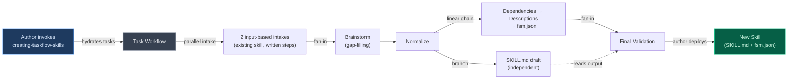
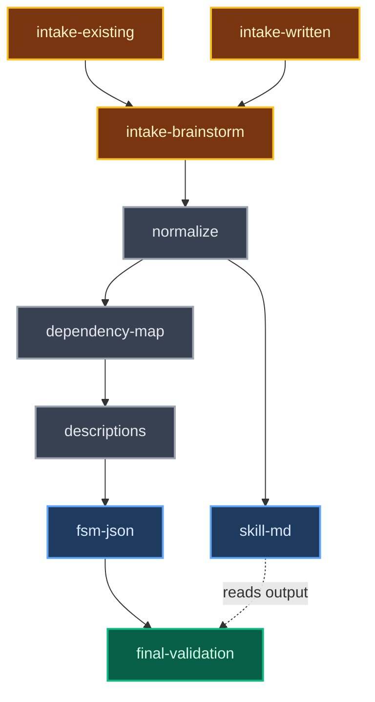

## Context

The finite-skill-machine (FSM) plugin enables skills to define structured task workflows via a SKILL.md + fsm.json companion pair. When a skill is invoked, the `hydrate-tasks.py` PostToolUse hook reads the fsm.json, translates local IDs to session-scoped IDs, and writes task files to `~/.claude/tasks/{session_id}/`. A PreToolUse guard prevents the agent from reading SKILL.md or fsm.json directly — after hydration, the task descriptions become the sole instruction source as the original skill text is compacted away.

Creating FSM-enabled skills currently requires reverse-engineering this structure from validation code and existing examples. This skill (`finite-skill-machine:creating-taskflow-skills`) automates that authoring process through a guided multi-task workflow.

**This skill is itself an FSM skill**: it ships as a SKILL.md + fsm.json pair within the FSM plugin. Its tasks guide the author through creating a *new* SKILL.md + fsm.json pair for the author's own skill. The output artifacts follow the same format as the skill itself.

**Intake path handling**: fsm.json defines a static task list — it cannot conditionally activate tasks at runtime. The two input-based intake sources (existing skill, written steps) are modeled as parallel unblocked tasks. Brainstorming runs sequentially after them as a gap-filling step. The intake sources are not mutually exclusive — author input may span multiple sources. The dependency graph is `(IE|IW) → IB → N`.

**Prior decisions referenced**:
- fsm.json companion file approach for task definitions (from FSM technical spec)
- `{"fsm": "skill-name"}` metadata format for scoped deletion (from FSM anti-clobber change)
- PreToolUse guard blocking direct reads of SKILL.md and fsm.json (from FSM technical spec). The `fsm-session-hook-bypass` change provides a hook bypass mechanism that exempts the authoring workflow from this guard, resolving the conflict between the guard and the progressive fsm.json construction pattern documented below — specifically, CMP-descriptions reading and updating the partial fsm.json written by CMP-dependency-map, and CMP-fsm-json-finalize reading the enriched result for final validation
- INT-fsm-json schema: JSON array with id, subject, description, activeForm, status, blockedBy, blocks, metadata, owner fields (from FSM technical spec)

**Code change**: The `description` field is added to the `validate_fsm_tasks` required field checks in `hydrate-tasks.py`, ensuring empty or missing descriptions are caught at hydration time. This is the only code modification in this change — the remaining deliverables are pure content files.

## Objectives

`OBJ-guided-authoring`: Author produces a valid SKILL.md + fsm.json pair for their new skill without needing to know FSM internals (hydration mechanics, hook system, task file schema, or ID translation)

`OBJ-self-contained-output`: Every task description generated by the skill stands alone as the sole instruction source after context compaction — no description depends on the original skill text, sibling task content, or external references

`OBJ-incremental-validation`: Phase-gate validation at each workflow step catches errors early (intake, normalization, dependency mapping, description writing), complemented by a comprehensive cross-cutting final validation pass that validates generated artifacts before the skill session completes

`OBJ-intake-convergence`: Two input-based intake sources (existing skill analysis, written step descriptions) feed into a brainstorming gap-filling step, then converge into a single normalized step list in a consistent format, enabling all downstream tasks to operate path-agnostically

## Architecture

### System overview

The skill itself is an FSM skill — when invoked, the hook hydrates tasks that guide the author through creating their own SKILL.md + fsm.json pair. The output artifacts (rightmost node) follow the same INT-fsm-json schema and SKILL.md conventions that this skill itself uses.

### Task dependency graph

The following flowchart (this skill's task dependency graph, not the parent FSM hydration pipeline) is **authoritative** for task ordering and dependency structure.

- **CMP-intake-existing, CMP-intake-written**: Parallel input-based intake (both unblocked, both block CMP-intake-brainstorm). Two non-exclusive intake sources — each task contributes whatever material applies from the author's input, or marks itself complete if it has nothing to add.
- **CMP-intake-brainstorm**: Sequential gap-filling step (blocked by CMP-intake-existing and CMP-intake-written, blocks CMP-normalize). Receives context from whatever material those intakes produced and fills gaps — or produces the full step list from scratch if neither input-based intake contributed material.
- **CMP-normalize**: Blocked by CMP-intake-brainstorm. Normalizes whichever intake sources produced output into a consistent step list format. Confirms the skill name (kebab-case normalization) and collects the output directory — both are used by all downstream tasks.
- **CMP-skill-md**: Branches off CMP-normalize independently. Receives the normalized step list, confirmed skill name, and output directory to write author-facing documentation and place files. Self-validates (frontmatter check) and completes independently. CMP-final-validation reads its output from disk for the name-consistency check (dashed edge) — this is a data-read dependency, not a blocking task dependency.
- **CMP-dependency-map → CMP-descriptions → CMP-fsm-json-finalize**: Linear chain. Dependency mapping → self-contained description writing → fsm.json finalization.
- **CMP-final-validation**: Depends on CMP-fsm-json-finalize (blocking task dependency). Also reads CMP-skill-md output from disk for the name-consistency check (data-read dependency, dashed edge). Cross-cutting validation runs after the fsm.json artifact is finalized.

### Data flow

| Phase | Component | Output artifact | Format |
|-------|-----------|----------------|--------|
| Intake (existing skill) | CMP-intake-existing | Raw workflow material or skip | Extracted steps with labels and descriptions from the existing skill's structure |
| Intake (written steps) | CMP-intake-written | Raw workflow material or skip | Authored step descriptions as provided by the author |
| Intake (brainstorming — gap-filling) | CMP-intake-brainstorm | Gap-filling material, full step list, or skip | Additional steps filling gaps from prior intake material, or a full brainstormed step sequence if no prior material exists |
| Normalization | CMP-normalize | Normalized step list, confirmed skill name, output directory | Numbered list of `{label, description}` pairs — consistent format regardless of intake path; confirmed kebab-case skill name; author-specified output directory |
| Dependency mapping | CMP-dependency-map | Partial fsm.json at `<output-directory>/<skill-name>/fsm.json` | JSON array of `{id, subject, blockedBy}` entries — written to disk as the shared intermediate fsm.json artifact |
| Description writing | CMP-descriptions | Partial fsm.json (updated in-place) | `<output-directory>/<skill-name>/fsm.json` updated with `description` and `activeForm` per entry — each description is self-contained |
| SKILL.md generation | CMP-skill-md | `<output-directory>/<skill-name>/SKILL.md` (final, self-validated) | Markdown with YAML frontmatter (`name`, `description`) and body content in author-facing language |
| fsm.json finalization | CMP-fsm-json-finalize | `<output-directory>/<skill-name>/fsm.json` (final) | JSON array following INT-fsm-json schema: `{id, subject, description, activeForm, blockedBy}` per entry — validated and overwritten at the same path |
| Final validation | CMP-final-validation | Validation report | Pass/fail results for 4 cross-cutting checks with specific issues listed per failure |

### Validation scope

| Check | Component | When |
|-------|-----------|------|
| Step labels and descriptions present | CMP-normalize | After normalization |
| Minimum step count (1+) | CMP-normalize | After normalization |
| All tasks in dependency graph | CMP-dependency-map | After dependency mapping |
| No dangling dependency references | CMP-dependency-map | After dependency mapping |
| No circular dependencies (early) | CMP-dependency-map | After dependency mapping |
| Step list modifications (add/remove/rename) re-validated | CMP-dependency-map | After each modification |
| Non-empty, non-placeholder descriptions | CMP-descriptions | After description writing |
| Self-containment checklist (per-description) | CMP-descriptions | After each description is drafted/approved |
| Dependency graph integrity after task split or merge | CMP-descriptions | After each accepted split or merge; pipeline gates on re-validation pass before continuing to the next description |
| Frontmatter validation (SKILL.md) | CMP-skill-md | Self-validation during SKILL.md generation |
| Cycle detection (final) | CMP-final-validation | Final pass |
| Self-containment audit (cross-cutting) | CMP-final-validation | Final pass |
| Structural integrity (JSON, IDs, refs, types, metadata) | CMP-final-validation | Final pass |
| Name consistency (SKILL.md name matches fsm.json metadata.fsm) | CMP-final-validation | Final pass |
| Description field present and non-empty | CMP-validate-description-field | At hydration time (runtime) |

Phase checks handle format and completeness within one phase via conversational validation — the agent identifies issues and works with the author to fix them inline. CMP-skill-md self-validates SKILL.md frontmatter and completes independently. CMP-descriptions runs the self-containment checklist per-description, giving authors immediate feedback. Final checks handle cross-cutting concerns that require the complete fsm.json picture and produce structured pass/fail results per check — the only validation point with a defined presentation format. Cycle detection runs at both dependency-mapping and final-validation levels: early detection at CMP-dependency-map prevents wasted effort, while CMP-final-validation retains it as a final safety net.

## Components

`CMP-intake-existing`: Existing skill intake
- **Description**: One of two parallel input-based intake sources. Handles the case where the author provides an existing skill to transform into an FSM workflow. If the author's input does not include an existing skill, this task has nothing to contribute and should be marked complete immediately. Output flows to CMP-intake-brainstorm (gap-filling step), not directly to CMP-normalize.
- **Responsibilities**:
  - Evaluate whether the author's input includes material for this source; if applicable, extract applicable material and get author confirmation before proceeding
  - If not applicable: mark task complete with no output
  - If applicable: analyze the existing skill's structure and extract discrete workflow steps in the order they appear
  - Identify implicit parallelism where independent operations have no data dependencies
  - Present extracted steps for author review — author can confirm, add, remove, reorder, or rename steps
  - Validate that at least one step emerges; if zero steps emerge, mark task complete with no output
- **Dependencies**: None (unblocked intake task)

`CMP-intake-written`: Written steps intake
- **Description**: One of two parallel input-based intake sources. Handles the case where the author provides written step-by-step descriptions of their intended workflow. If the author's input does not include written step descriptions, this task has nothing to contribute and should be marked complete immediately. Output flows to CMP-intake-brainstorm (gap-filling step), not directly to CMP-normalize.
- **Responsibilities**:
  - Evaluate whether the author's input includes material for this source; if applicable, extract applicable material and get author confirmation before proceeding
  - If not applicable: mark task complete with no output
  - If applicable: evaluate each description for specificity, actionability, and appropriate scope
  - Accept well-structured descriptions with at most minor formatting adjustments
  - Prompt for clarification on vague descriptions that lack specificity about what work is performed
  - Suggest splitting overly broad steps that encompass multiple distinct operations, with specific boundary recommendations
  - Validate that at least one step emerges; if zero steps emerge, mark task complete with no output
- **Dependencies**: None (unblocked intake task)

`CMP-intake-brainstorm`: Brainstorming intake (gap-filling)
- **Description**: Sequential gap-filling step that runs after the two input-based intakes (CMP-intake-existing, CMP-intake-written) complete. Receives context from whatever material those intakes produced and fills gaps — generating ideas for missing areas, expanding thin coverage, or producing the full step list from scratch if neither input-based intake contributed material. This is not a parallel intake source; it is a sequential step that builds on prior intake output.
- **Responsibilities**:
  - Review the material contributed by the input-based intakes to understand what coverage exists
  - If prior intakes produced substantial material: identify gaps or thin areas in the step coverage and brainstorm additional steps to fill them; present proposed additions to the author for confirmation
  - If prior intakes produced no material: guide the author through brainstorming a full step list from scratch
  - Consolidate overlapping ideas that describe the same or substantially similar work into single steps, explaining which ideas were merged and why
  - Present the proposed step list to the author for confirmation — author can approve or request changes; do not advance until approved
  - Validate that at least one step exists (from prior intakes, this step, or both combined) before completing
  - If brainstorming yields no usable steps after the author declines to provide ideas and no prior intake produced material, acknowledge the author is not ready to define a workflow and suggest returning later — terminate the workflow gracefully
- **Dependencies**: CMP-intake-existing, CMP-intake-written (blocked by both input-based intakes)

`CMP-normalize`: Normalize into step list
- **Description**: Fan-in convergence point and branch point for all downstream tasks. Collects whatever workflow material exists and normalizes it into a consistent numbered step list format. Path-agnostic — operates on the available material without needing to know which intake path produced it. When multiple intake sources contribute material, concatenates all contributions without automatic deduplication — the author resolves duplicates during the confirmation step. Also confirms the skill name (kebab-case normalization with author confirmation) and collects the output directory from the author — both values are used by all downstream tasks for file placement and metadata. Includes an author confirmation gate.
- **Responsibilities**:
  - Collect all workflow material from intake sources and normalize into `{label, description}` pairs
  - Ensure every step has a short label and a description of the work it performs
  - Normalize the author-provided display name to a directory-safe kebab-case format (lowercase; spaces and special characters replaced with hyphens); present the normalized name to the author for confirmation or override; the confirmed name is used downstream for the directory path, the SKILL.md frontmatter `name` field, and the `metadata.fsm` value in fsm.json entries
  - Collect the output directory from the author — the path where the skill files (`SKILL.md`, `fsm.json`) will be placed; this is any author-specified directory, not constrained to a particular project convention
  - Present the normalized step list, confirmed skill name, and output directory to the author for confirmation
  - Incorporate author modifications (add, remove, reorder, rename steps)
  - Validate: at least one step, no empty descriptions
  - If validation fails, present the issue to the author for correction before completing
- **Dependencies**: CMP-intake-brainstorm (blocked by brainstorming, which itself depends on the two input-based intakes)

`CMP-dependency-map`: Map dependencies
- **Description**: Guides the author through encoding execution relationships between tasks. Covers serial chains, parallel groups, fan-in, fan-out, and diamond patterns. Includes an author review gate.
- **Responsibilities**:
  - Help the author express serial dependencies (task A blocks task B)
  - Identify tasks eligible for parallel execution (no mutual dependencies)
  - Encode fan-out (one predecessor, multiple independent successors) and fan-in (multiple predecessors, one successor) patterns
  - Present the complete dependency graph for author review; for single-task workflows, confirm the trivially empty graph with a note that no dependencies exist and proceed; allow the author to modify dependencies after review
  - Validate that every task appears in the graph and all dependency references point to existing tasks
  - Validate that no circular dependencies exist by invoking the cycle detection script (CMP-cycle-detect-script)
  - Support step list modifications during this phase with per-operation behavior:
    - **Add**: prompt the author for the new task's dependencies before updating the graph; assign the next sequential ID (max existing ID + 1); existing task IDs remain stable
    - **Remove**: propagate the removed task's predecessors to its dependents (each dependent inherits the removed task's blockedBy entries, preserving the ordering chain and preventing silent conversion of sequential execution to parallel); then remove the task entry and garbage-collect any remaining blockedBy references to it
    - **Rename**: update the task's subject and all references throughout the dependency table
  - Each modification triggers a dependency graph update and re-validation
  - If validation fails, present the issue to the author for correction before completing
  - Create the target directory `<output-directory>/<skill-name>/` if it does not exist; write the partial fsm.json artifact to `<output-directory>/<skill-name>/fsm.json` with `{id, subject, blockedBy}` per task entry; this shared intermediate artifact is progressively updated by CMP-descriptions and finalized by CMP-fsm-json-finalize at the same path
- **Dependencies**: CMP-normalize output (normalized step list, confirmed skill name, output directory), CMP-cycle-detect-script (for cycle detection)

`CMP-descriptions`: Write self-contained descriptions
- **Description**: Generates task descriptions from the intake understanding and presents drafts to the author for approval or editing. Each description must stand alone as the sole instruction source after context compaction. Enforces self-containment rules, catches anti-patterns, and provides sizing guidance.
- **Responsibilities**:
  - Present tasks one at a time in dependency order during the description writing phase; author can request to skip to a specific task or return to revise a previously completed one
  - Generate description drafts from the intake understanding; present each draft to the author for approval or editing
  - Ensure each description includes goal, constraints, and expected outcome
  - Detect and flag external references ("as described in the skill," "per the instructions above") — instruct the author to inline the referenced content
  - Detect and flag inter-task references (references to other tasks by name, implicit ordering assumptions) — instruct the author to state preconditions explicitly
  - Evaluate task sizing: flag descriptions covering multiple objectives (recommend splitting) and overly small descriptions (recommend merging)
  - When the author accepts a split recommendation, apply deterministic node expansion on the partial fsm.json: replace the pre-split entry with new entries using IDs assigned by the max+1 rule (max existing ID + 1, incrementing for each new entry); each post-split entry inherits the pre-split task's blockedBy entries (parent-side); all blockedBy references to the pre-split task ID in other entries are replaced with references to all post-split task IDs (child-side fan-out); warn the author that inherited relationships may be imprecise; re-validate the dependency graph after splitting by invoking the cycle detection script (CMP-cycle-detect-script)
  - When the author accepts a merge recommendation, apply deterministic node merging on the partial fsm.json: the lower task ID survives; blockedBy entries from both tasks are unioned into the surviving entry; the surviving task's own ID is then filtered from the resulting blockedBy set (for adjacent tasks — the sole merge-eligible case — the removed task's blockedBy contains the surviving task's ID, so raw union produces a self-reference that this filter removes); all blockedBy references to the removed task in other entries are updated to point to the surviving task; "adjacent" for merge eligibility means the two tasks share a direct blockedBy edge; re-validate the dependency graph after merging by invoking the cycle detection script (CMP-cycle-detect-script)
  - When the author declines a split or merge suggestion, accept the description as-is and continue to the next task in dependency order
  - After any confirmed split or merge, the pipeline does not continue to the next description until dependency graph re-validation passes; both deterministic node expansion (split) and the complete merge procedure (blockedBy union followed by self-ID filter) are structure-preserving operations on acyclic graphs — re-validation is retained as defense-in-depth; if re-validation detects a cycle, present the cycle-participating tasks and edges (from the cycle detection script output) to the author and allow removal or redirection of specific blockedBy entries to break the cycle, then re-run re-validation; this in-place edge correction stays within the description phase, consistent with the split/merge callback already modifying the dependency graph in-phase
  - Run the self-containment checklist on each description: (a) goal statement, (b) specific actions, (c) acceptance criteria, (d) no undefined references
  - Allow the author to return and revise a previously approved description; re-evaluate for self-containment before accepting
  - Auto-generate activeForm by deriving present-continuous form from task label (e.g., "Validate dependencies" → "Validating dependencies"); present to author for confirmation or override
  - Read the partial fsm.json at `<output-directory>/<skill-name>/fsm.json` (written by CMP-dependency-map) and update each entry in-place with `description` and `activeForm` fields
  - Validate that every task has a non-empty, non-placeholder description
  - If validation fails, present the issue to the author for correction before completing
- **Dependencies**: CMP-dependency-map output (partial fsm.json with IDs, subjects, and blockedBy entries), CMP-cycle-detect-script (for post-split/merge re-validation)

`CMP-skill-md`: Draft SKILL.md
- **Description**: Generates the SKILL.md file for the author's new skill. Branches off CMP-normalize — receives the normalized step list, confirmed skill name, and output directory to write author-facing documentation and place files. Produces YAML frontmatter and body content in author-facing language. Self-validates (frontmatter check) and completes as a task-independent branch — no blocking edge to CMP-final-validation, though CMP-final-validation reads its disk output for the name-consistency cross-check (data-read dependency, not a task dependency).
- **Responsibilities**:
  - Generate YAML frontmatter with `name` and `description` fields
  - Use the confirmed skill name (received from CMP-normalize) for the frontmatter `name` field and the `metadata.fsm` value
  - Write body content describing workflow steps in terms the skill's end user understands
  - Reference tasks by their purpose, not by file names or internal identifiers
  - Validate YAML frontmatter contains `name` and `description` fields; if missing, prompt the author to provide them before completing (self-validation — not deferred to CMP-final-validation)
  - Create the target directory `<output-directory>/<skill-name>/` if it does not exist
  - Detect when the target skill directory already exists and contains files; offer the author options to overwrite, choose a different skill name, or abort
  - Guide the author on file placement: `<output-directory>/<skill-name>/SKILL.md`
  - Write the SKILL.md file to disk using the Write tool
- **Dependencies**: CMP-normalize output (normalized step list, confirmed skill name, output directory)

`CMP-fsm-json-finalize`: Finalize fsm.json
- **Description**: Finalizes the progressively-built fsm.json artifact for the author's new skill. Since progressive construction builds the fsm.json incrementally across earlier phases (IDs and subjects from dependency mapping, blockedBy from dependency encoding, descriptions and activeForm from description writing), this component's role is finalization — validating, renumbering, and writing the final artifact. Produces a JSON array with 5 core fields per entry plus metadata. Optional fields (owner, status, blocks) are omitted — defaults apply at hydration time.
- **Responsibilities**:
  - Validate and format the progressively-built fsm.json artifact into a final JSON array with one entry per workflow task
  - Invoke CMP-cycle-detect-script in renumber mode to renumber all task IDs to topological order (sequential starting at 1) and update all blockedBy references; present the old-to-new ID mapping to the author
  - Verify each entry contains 5 core fields with correct types: `id` (integer, sequential starting at 1), `subject` (string), `description` (string), `activeForm` (string), `blockedBy` (array of integers)
  - Verify each entry contains `metadata` (object) with an `fsm` key whose value is a non-empty string matching the skill name
  - Validate that all `blockedBy` references point to IDs that exist in the same array
  - Write the finalized fsm.json to `<output-directory>/<skill-name>/fsm.json` using the Write tool, overwriting the intermediate artifact at the same path
- **Dependencies**: Partial fsm.json at `<output-directory>/<skill-name>/fsm.json` (progressively built by CMP-dependency-map and updated by CMP-descriptions), confirmed skill name (propagated through the linear chain from CMP-normalize), CMP-cycle-detect-script (for topological renumbering)

`CMP-final-validation`: Final validation
- **Description**: Dedicated validation task that runs 4 cross-cutting checks after the fsm.json artifact is finalized. Catches issues that incremental phase checks cannot detect because they span the complete task definition. SKILL.md validation (frontmatter check) is handled by CMP-skill-md's self-validation and is not repeated here.
- **Responsibilities**:
  - **Cycle detection**: Verify no circular dependencies exist in the fsm.json draft's `blockedBy` graph by invoking the cycle detection script (CMP-cycle-detect-script)
  - **Self-containment audit**: Re-verify every task description stands alone using the self-containment checklist: (a) goal statement, (b) specific actions, (c) acceptance criteria, (d) no undefined references. Flag any description that references the SKILL.md text, sibling tasks, or assumes context not present in the description
  - **Structural integrity**: Verify fsm.json is a valid JSON array; each entry has required fields (`id`, `subject`, `description`, `activeForm`, `blockedBy`) with correct types; all IDs are unique; all `blockedBy` references resolve; each entry contains `metadata.fsm` as a non-empty string matching the skill name
  - **Name consistency**: Verify `metadata.fsm` in fsm.json matches the SKILL.md frontmatter `name` field
  - **Correction paths per failure type**:
    - *Self-containment*: the author corrects the description in-place within the final validation task — no regression to the description writing phase is needed; re-evaluate the corrected description before proceeding
    - *Cycle detection*: present the cycle-participating tasks and edges (from the cycle detection script output) to the author; allow removal or redirection of specific blockedBy entries directly in the fsm.json to break the cycle; re-run cycle detection after correction
    - *Structural integrity*: identify the specific entry and the invalid field or reference; provide in-place correction guidance (e.g., missing field, wrong type, dangling blockedBy reference) so the author can fix the fsm.json entry directly
    - *Name consistency*: identify the mismatched values and prompt the author to choose which name to keep; update the non-matching artifact in-place
  - Present pass/fail results per check with specific issues listed for each failure; do not finalize until all checks pass
- **Dependencies**: CMP-fsm-json-finalize output (fsm.json draft), CMP-cycle-detect-script (for cycle detection), SKILL.md content (produced by CMP-skill-md) for the name-consistency check

`CMP-cycle-detect-script`: Cycle detection and topological renumbering Python script
- **Description**: Deterministic graph operations utility invoked programmatically by CMP-dependency-map, CMP-descriptions, CMP-fsm-json-finalize, and CMP-final-validation via Bash tool. Located at `plugins/finite-skill-machine/scripts/detect_cycles.py`. To be created as part of implementation. Supports two modes: cycle detection (default) and topological renumbering.
- **Responsibilities**:
  - **Cycle detection mode** (default):
    - Accept a JSON dependency graph on stdin: array of `{id, blockedBy}` objects
    - Perform topological sort to detect cycles
    - Exit 0 with empty stdout if no cycles found
    - Exit 1 with JSON array of cycle-participating task IDs on stdout if cycles detected
    - Exit 2 with error message on stderr for malformed input
  - **Renumber mode** (`--renumber`):
    - Accept a JSON dependency graph on stdin: array of `{id, blockedBy}` objects
    - Compute topological order and assign sequential IDs starting at 1
    - Update all blockedBy references to use the new IDs
    - Exit 0 with JSON object on stdout: `{tasks: [{id, old_id, blockedBy}], mapping: {old_id: new_id}}`
    - Exit 1 if cycles detected (renumbering requires an acyclic graph)
    - Exit 2 with error message on stderr for malformed input
- **Dependencies**: Python 3 stdlib only (no external packages)
- **Testing**: Unit tests via pytest covering acyclic graphs, single cycles, multi-node cycles, malformed input, and renumbering with various graph topologies

`CMP-validate-description-field`: Description field validation enhancement
- **Description**: Modification to the existing `validate_fsm_tasks` function in `hydrate-tasks.py` to include `description` in the required field checks. Ensures empty or missing task descriptions are caught at hydration time, closing the gap between authoring-time validation (CMP-descriptions, CMP-final-validation) and runtime validation.
- **Responsibilities**:
  - Add `description` to the list of required fields validated by `validate_fsm_tasks`
  - Reject task entries with empty or missing `description` fields during hydration
- **Dependencies**: Existing `hydrate-tasks.py` validation infrastructure
- **Testing**: Unit tests via pytest verifying that tasks with missing or empty description fields are rejected by `validate_fsm_tasks`

## Decisions

In the context of handling intake sources in the workflow, facing the constraint that fsm.json cannot conditionally activate tasks at runtime, we decided on two parallel input-based intake tasks (existing skill, written steps) that fan-in to a sequential brainstorming task before normalize, and neglected a single intake task containing all source descriptions (which would produce a long description vulnerable to context compaction) and three parallel intake tasks (which prevents brainstorming from leveraging material gathered by input-based intakes), to achieve brainstorming that fills gaps with full awareness of what the input-based intakes already contributed, accepting that the brainstorming task always executes even when input-based intakes provide complete coverage (it marks itself complete with no output in that case).

In the context of validation strategy for the authoring workflow, facing the need to catch errors both incrementally and comprehensively, we decided on embedded incremental validation within each phase task plus a dedicated CMP-final-validation task for cross-cutting checks, and neglected separate validation tasks per phase (which would nearly double the task count) or final-only validation (which would delay error discovery), to achieve early error detection at each phase gate combined with cross-artifact checks that only a complete-picture pass can provide, accepting that validation logic is distributed across task descriptions rather than centralized.

In the context of SKILL.md generation for the author's new skill, facing the question of what information CMP-skill-md needs to produce author-facing documentation, we decided to branch CMP-skill-md off CMP-normalize (needing only the normalized step list to describe broad workflow concepts) with self-validation of frontmatter, and neglected making CMP-skill-md depend on CMP-descriptions (which would delay SKILL.md generation until all task descriptions are written, despite SKILL.md describing workflow concepts rather than task-level details), to achieve early independent SKILL.md generation that self-validates and completes without entering the fsm.json validation pipeline, accepting that CMP-final-validation reads SKILL.md output for the name-consistency cross-check (a data-read dependency) but does not cover SKILL.md structural checks — the frontmatter check is self-validated within CMP-skill-md.

In the context of normalizing intake output from multiple sources, facing the need for a clean convergence point before downstream tasks operate, we decided on a dedicated CMP-normalize after CMP-intake-brainstorm with an explicit author confirmation gate, and neglected embedding normalization in each intake task (which would triplicate the normalization logic) or deferring normalization to CMP-dependency-map (which would conflate two concerns), to achieve a single convergence point where the author confirms the step list before dependency work begins, accepting that CMP-normalize must handle output from any combination of intake sources.

In the context of data format specifications consumed by multiple downstream tasks, facing the trade-off between DRY format definitions and self-contained task descriptions, we decided on repeating named format specifications in each consuming task's description, and neglected defining formats once in an early task and referencing them from later tasks (which would violate self-containment since descriptions must stand alone after compaction — without the repeated format spec, the agent would have no field definitions to follow), to achieve task descriptions that remain the sole instruction source regardless of which other tasks the agent has seen, accepting redundant format definitions across task descriptions.

In the context of self-containment validation timing, facing the trade-off between catching self-containment issues early versus centralizing validation at final pass, we decided to run the self-containment checklist as a per-description check in CMP-descriptions while retaining the full audit at CMP-final-validation as a cross-cutting safety net, and neglected deferring all self-containment checking to CMP-final-validation only (which delays feedback until after all descriptions are written), to achieve immediate author feedback on each description's self-containment during the writing phase, accepting that the self-containment checklist runs twice (per-description and at final validation) creating intentional validation redundancy.

In the context of validation result presentation across components, facing the question of whether all validation points need a defined output format, we decided on two distinct validation modes — incremental phase-gate validation is conversational (the agent identifies issues and works with the author to fix them inline, no formal output structure) while CMP-final-validation produces structured pass/fail results per check with specific issues listed per failure — and neglected a uniform structured format for all validation points (which would impose unnecessary formality on interactive dialogue during authoring phases), to achieve natural interactive validation during authoring with formal structured reporting only at the final gate, accepting that incremental validation results are not machine-parseable since they serve human authors in dialogue.

In the context of the name-consistency check scope at CMP-final-validation, facing the question of whether to include the on-disk directory name in a 3-way consistency check (directory name vs metadata.fsm vs SKILL.md frontmatter name), we decided on a 2-field check (metadata.fsm must match SKILL.md frontmatter name) and neglected a 3-way check that also validates the directory name, to achieve focused validation on the most likely error vector (manual metadata editing that drifts from the SKILL.md name), accepting that a directory-name mismatch requires intentional author override of the auto-normalized name — the auto-normalize step in CMP-normalize produces consistent directory name, metadata.fsm, and SKILL.md name values from the same normalized input.

In the context of cycle detection in dependency graphs, facing the need for reliable detection of circular dependencies during authoring, we decided on a deterministic Python script (`detect_cycles.py`) invoked programmatically via Bash tool and neglected agent-native LLM reasoning for cycle detection, to achieve auditable, repeatable correctness guarantees for a safety-critical validation check, accepting the overhead of a separate script invocation and the requirement to maintain the script alongside the skill.

In the context of correctness-critical graph operations (cycle detection and topological renumbering), facing the inconsistency that agent-native LLM reasoning was rejected for cycle detection but implicitly relied upon for topological renumbering of task IDs and blockedBy cross-references, we decided to consolidate both operations into CMP-cycle-detect-script as two modes (cycle detection and `--renumber`) sharing the same topological sort foundation, and neglected keeping renumbering as an agent-native operation (which has the same reliability risk as agent-native cycle detection — an ID/blockedBy mismatch produces a silently broken dependency graph) and creating a separate renumbering script (which would duplicate the topological sort implementation), to achieve deterministic correctness guarantees for all graph operations that modify or validate the dependency structure, accepting the slightly increased scope of the `detect_cycles.py` script and the requirement for CMP-fsm-json-finalize to invoke it via Bash tool.

In the context of skill name normalization and its availability to downstream components, facing the need for the confirmed skill name in both the CMP-skill-md branch and the CMP-dependency-map → CMP-descriptions → CMP-fsm-json-finalize chain, we decided to move skill name normalization (kebab-case conversion and author confirmation) from CMP-skill-md to CMP-normalize, and neglected adding a dependency edge from CMP-fsm-json-finalize to CMP-skill-md or introducing a shared data store for the confirmed name, to achieve natural availability of the confirmed name to all downstream tasks through existing dependency edges from the branch point, accepting that CMP-normalize's responsibilities expand beyond step list normalization to include naming and placement concerns.

In the context of file placement for generated skill artifacts, facing the assumption that skills are always placed under a plugin-specific directory structure, we decided to generalize file placement to `<output-directory>/<skill-name>/` where the output directory is any author-specified path collected at CMP-normalize, and neglected retaining the `plugins/<plugin>/skills/<skill>/` convention with a dedicated plugin directory collection step, to achieve placement flexibility that is agnostic to the project's directory conventions, accepting that the author must specify the full output directory path rather than selecting from a predefined plugin list.

In the context of task splitting during the description writing phase, facing the conflict that dependency mapping has already finalized the graph when CMP-descriptions recommends splitting an overly broad task, we decided on deterministic node expansion — all parents of the pre-split task become parents of all post-split tasks, and all children of the pre-split task become children of all post-split tasks — with an author warning that inherited relationships may be imprecise, and neglected rejecting splits entirely after dependency mapping (which would force the author to restart from dependency mapping) and re-opening the dependency mapping phase for a full re-mapping (which would violate the strictly-forward pipeline), to achieve in-phase split resolution that preserves the forward-only pipeline while maintaining a valid dependency graph, accepting that inherited relationships may be overly broad and the author must review them after splitting.

## Risks

**Intake evaluation overhead** → All intake tasks are hydrated as pending. The two input-based intake tasks run in parallel; the agent evaluates each to determine whether the author's input includes material for that source. If the agent misidentifies which sources apply (e.g., treats written steps as brainstorming material), the wrong intake task produces output. Mitigation: each input-based intake task's description begins with explicit applicability criteria. CMP-intake-brainstorm reviews prior intake output before acting. The CMP-normalize gate provides a recovery point where the author reviews and corrects the step list regardless of which intake sources contributed.

**Self-containment of format specifications** → The normalized step list format, dependency table format, and enriched task list format are each repeated in every consuming task description to maintain self-containment. If these format definitions drift between tasks during manual editing, downstream tasks may produce inconsistent output. Mitigation: CMP-final-validation performs structural integrity checks on the generated fsm.json, catching format inconsistencies before deployment. Format definitions are short enough (2-4 fields each) that redundancy is manageable.
