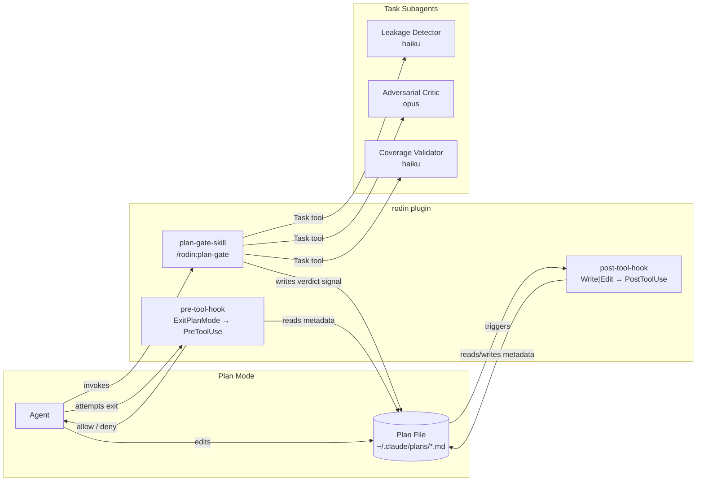
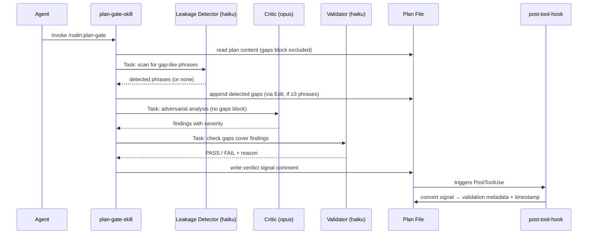

## Context

Claude Code's plan mode (`permission_mode == "plan"`) restricts the agent to modifying only
the plan file. The rodin plugin operates entirely within this constraint: a skill the agent
invokes, hooks that fire on plan file edits, and a gate that fires at exit. All plugin logic
is bash scripting with `jq` as the sole non-POSIX dependency. The `sed` cross-platform
constraint (macOS `-i ''` vs GNU `-i`) requires a platform-detection helper in every hook.

## Objectives

- Force the agent to demonstrate gap awareness before exiting plan mode
- Surface gaps the agent missed using an adversarial critic subagent
- Validate that the agent's documented gaps cover the critic's findings
- Fail closed on all errors: missing metadata, hash mismatches, unparseable output
- Keep assessment opt-in via skill invocation (not automatic)

## Architecture

### System Overview

### Component Interaction — Assessment Flow

## Components

### `plan-gate-skill`

**Responsibilities:**
- Validate plan mode context (plan file path in system context)
- Validate plan structure: `## Goals` section present, gaps block markers present
- Orchestrate three Task subagents in sequence: leakage detector → critic → validator
- Retry failed subagents once; fail closed on second failure
- Write compact JSON verdict signal to plan file

**Subagent model assignment:**
- **Leakage detector** — haiku: fast keyword scan, cheap, deterministic threshold logic
- **Critic** — opus: adversarial analysis requires depth and broad world knowledge
- **Validator** — haiku: mechanical coverage comparison, semantic match is LLM judgment but low complexity

**Critic isolation:** Plan content passed to critic excludes the `<!-- rodin:gaps:start -->` to
`<!-- rodin:gaps:end -->` block. Prevents accidental priming — critic finds gaps independently.
Soft constraint only: critic has tool access and could read the file, but this is an accepted
trade-off for the embedded metadata architecture.

**Subagent output contracts:**
- Critic: `### FINDING-N: <title>` or `### NO ISSUES FOUND`
- Validator: `### VERDICT: PASS` or `### VERDICT: FAIL`
- Parseability check precedes retry decision; unparseable output triggers one retry

**Dependencies:** Task tool (subagent orchestration), Edit tool (verdict signal write)

---

### `post-tool-hook`

**Responsibilities:**
- Activate only in plan mode (`permission_mode == "plan"`) on files in `~/.claude/plans/`
- Inject session marker on first edit: `<!-- rodin:session=<session_id> -->`
- Compute and update plan hash: file content excluding all `<!-- rodin:* -->` blocks
- Compute and update gaps hash: content between gaps block markers (empty string if no gaps)
- Convert verdict signal to validation metadata + timestamp; remove signal comment
- Reset validation to pending when no verdict signal present

**Error handling:** Fail-open (exit 0 on all errors). PostToolUse is a maintenance hook; enforcement
is the PreToolUse hook's responsibility. Silent failure here is safe because PreToolUse will
catch missing or stale metadata at exit time.

**Path security:** Canonicalize file path via `python3 -c "import os; print(os.path.realpath(...))"`;
reject paths outside `~/.claude/plans/` to prevent directory traversal.

**Dependencies:** `jq` (JSON parsing), `shasum` (SHA-256 hashing), `sed` (text extraction,
in-place edit), `date` (ISO 8601 timestamp), `python3` (realpath portability)

---

### `pre-tool-hook`

**Responsibilities:**
- Discover plan file by grepping `~/.claude/plans/*.md` for current session marker
- Compute current plan hash and compare to recorded hash (blocks on mismatch)
- Compute current gaps hash and compare to recorded hash (blocks on mismatch)
- Extract and parse validation JSON; enforce verdict: pass → allow, fail/pending → block
- Fail closed on all errors: missing session, missing metadata, unparseable JSON, unknown status

**Error handling:** Fail-closed (exit 1 with clear message). PreToolUse is the enforcement gate;
silent failures would allow bypass. Every unexpected state is treated as "no valid assessment."

**Dependencies:** `jq` (JSON parsing and validation status extraction), `shasum`, `sed`, `grep`

## Decisions

### Shell vs Python for hook scripts

In the context of the rodin plugin hooks (post-tool-hook, pre-tool-hook),
facing the need to run in the Claude Code hook execution context without additional runtime setup,
we decided on Bash with targeted Python3 fallbacks for portability edge cases (e.g., `realpath`)
and neglected a full Python3 rewrite or a Node.js approach,
to achieve zero-install execution in the Claude Code hook environment,
accepting platform portability quirks (`sed -i` syntax differences, `shasum`/`sha256sum` aliasing) that must be worked around case by case. `[ported-from-rodin]`

---

### Embedded vs external metadata

In the context of rodin's state management for plan-mode assessment,
facing the need to track session identity, content hashes, and verdict without external files,
we decided on embedding all state as HTML comments in the plan file
and neglected external state files (e.g., `~/.claude/rodin/<session>.json`) or a SQLite database,
to achieve a self-contained, cleanup-free plan artifact readable in any markdown viewer,
accepting slightly weaker critic isolation (critic could read the gaps block if it uses tool access) and hash computation tied to exact whitespace. `[ported-from-rodin]`

---

### Fail-closed vs fail-open for enforcement

In the context of the PreToolUse hook enforcing the assessment gate,
facing the choice between blocking on ambiguous state or allowing workflow continuity,
we decided on fail-closed behavior (block on any unexpected state)
and neglected fail-open (allow exit if metadata is ambiguous or missing),
to achieve tamper resistance and consistent enforcement regardless of edge cases,
accepting that transient hook failures (e.g., disk full, permissions error during metadata write) require user intervention to recover. `[ported-from-rodin]`

---

### haiku for leakage/validation, opus for criticism

In the context of the three subagent roles in plan-gate-skill,
facing the cost-quality tradeoff for different analysis tasks,
we decided on haiku for leakage detection and coverage validation, and opus for adversarial criticism
and neglected using opus for all subagents or haiku for all subagents,
to achieve adversarial depth where it matters (critic) at lower cost for mechanical tasks (leakage threshold, coverage comparison),
accepting that haiku may miss nuanced semantic coverage cases that opus would catch. `[ported-from-rodin]`

---

### Hook JSON schema defensive parsing

In the context of rodin hooks consuming Claude Code hook input JSON,
facing the risk of schema changes in Claude Code's hook API,
we decided on defensive parsing with null checks and fallback chains (e.g., `.tool_input.file_path // .tool_response.filePath`)
and neglected strict schema validation with explicit version pinning,
to achieve graceful degradation (PostToolUse fails open, PreToolUse fails closed with clear error) when field names change,
accepting that schema drift is silent until a hook fails at runtime. `[ported-from-rodin]`
