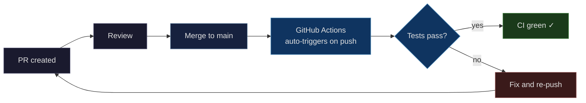

## Context

This is a CLI plugin repository with no deployed services. Infrastructure consists of the test pipeline: pytest configured via `pyproject.toml`, `make test` entry point, and GitHub Actions CI (`.github/workflows/test.yml`). The existing CI workflow runs on push to `main` and on pull requests.

Contributors set up the test environment within 4 commands after clone: `python -m venv .venv`, `source .venv/bin/activate`, `pip install ".[test]"`, then `make test`.

## Objectives

`OBJ-test-pass`: `make test` passes with zero failures — tests should always pass to maintain repository health.

`OBJ-convention-verified`: `grep -r "from conftest import" tests/` returns zero matches, confirming all bare conftest imports are eliminated and fixture injection is used consistently.

## Deployment

The repository uses GitHub Actions CI defined in `.github/workflows/test.yml`. The workflow runs on:
- Push to `main` branch
- Pull requests

No special deployment process exists beyond merging a PR.



## Testing Strategy

### Requirements Coverage

#### `isolated-plugin-tests`

- **Rule 1** (`@isolated-plugin-tests:1` — helper module separation): Verified by `grep -r "from conftest import" tests/` returning zero matches, `make test` confirming fixture injection resolves correctly, `make test PYTESTFLAGS="-W error"` confirming no collection warnings, and `pytest --collect-only` confirming helper modules are not collected. The existing FSM tests serve as the canary — if any import or fixture resolution issue exists, these tests would fail. Cross-plugin conftest isolation is a structural property of importlib mode documented in technical.md Decisions, not verified by dedicated scenarios.

#### `contributor-reproduces-environment`

| Rule | What it covers | Verification approach |
|------|---------------|----------------------|
| Rule 1: Project configuration declares test dependencies | pyproject.toml declares pytest, pip install works, pytest discovers tests | Manual during PR — reviewer runs `pip install ".[test]"`, then `pytest --collect-only` to confirm test discovery from correct directories, then `pytest` from root |
| Rule 2: Run all tests from project root | Makefile `test` and `test-<plugin>` targets work, including multi-plugin test collection verification | Manual during PR — reviewer runs `make test` and `make test-<plugin>` |
| Rule 3: Python version pinned | `.python-version` exists with correct version string | Manual during PR — reviewer checks file exists and contains expected version |
| Rule 4: Python artifacts excluded | `.gitignore` covers `.pytest_cache/`, `__pycache__/`, `*.pyc`, `.venv/` | Manual during PR — reviewer runs tests, confirms `git status` shows no artifacts |
| Rule 5: README documents setup | Testing section in README with setup steps and Makefile targets | Manual during PR — reviewer reads the testing section |

#### `ci-validates-pr`

| Rule | What it covers | Verification approach |
|------|---------------|----------------------|
| Rule 1: Tests run on push and PR | Workflow triggers on push to main and pull_request events | Self-verified — push to a branch, open PR, confirm workflow triggers and pytest runs |
| Rule 2: CI reports test status to GitHub | Failing tests exit non-zero, workflow reports failure status | Self-verified — the workflow's first successful run proves pass-path works. Fail-path verified by code review of Makefile recipe structure — single-line pytest invocations where make inherits the exit code. No manual failure induction required. |
| Rule 3: CI uses pinned Python version | `actions/setup-python` reads `.python-version` | Self-verified — workflow logs show Python version matching `.python-version` |

### Research Infrastructure

Research infrastructure is excluded from automated testing — notebooks are exploratory artifacts, not regression-testable code.

### Test Approach

Each plugin's test fixtures and test data are self-contained within its own directory — no shared test data infrastructure is needed. Plugin test suites exercise their helpers through their own fixtures.

This project has two distinct verification modes:
1. **Manual verification during PR review**: For local-facing configuration (pyproject.toml, Makefile, .python-version)
2. **Self-verification via CI**: For the pipeline itself (GitHub Actions workflow)

The existing plugin tests serve as the canary: if CI runs them successfully, every infrastructure component is working correctly. Test fixture directories (e.g., `tests/plugins/example-plugin/`, `tests/plugins/example-other/`, `tests/rogue/`) verify multi-plugin discovery, target isolation, and testpath boundary enforcement.

### Conventions

- **conftest.py is fixtures-only**: Each `conftest.py` under `tests/plugins/*/` contains exclusively `@pytest.fixture`-decorated functions. Under importlib mode, non-fixture code in conftest.py cannot be bare-imported — the convention is self-enforcing.
- **Helper module naming**: Helper modules (e.g., `helpers.py`) must not match pytest's collection patterns (`test_*.py` or `*_test.py`). Any name other than `conftest` works; `helpers` communicates intent and avoids collection. pytest will not attempt to collect `helpers.py` as a test module.
- **No bare imports across plugin boundaries**: Under importlib mode, bare `from conftest import` and `from helpers import` statements fail by design. Helper functions are exposed to test files via fixture wrapping: `conftest.py` loads helper modules via `importlib.util.spec_from_file_location` and exposes their functions as `@pytest.fixture(scope="session")` fixtures. Test files receive helpers through fixture injection — no import statements needed.

### Verification Commands

```bash
make test                                    # Expected: zero failures, all passed
make test PYTESTFLAGS="-W error"             # Expected: zero failures, no collection warnings
grep -r "from conftest import" tests/        # Expected: zero matches
pytest --collect-only tests/                 # Expected: no helper modules (e.g., helpers.py) appear in collected items
```

```bash
pip install -e ".[research]" && python -c "import jupyterlab; print('ok')"  # research deps resolve
```

The combination of `make test` (behavioral verification), `grep` (static review-time check), and `pytest --collect-only` (collection verification) provides defense in depth. `make test` confirms imports resolve and tests pass at runtime. `grep` catches stale bare imports at review time. The `-W error` flag ensures collection warnings about helper modules surface as failures. `pytest --collect-only` verifies that helper modules named to avoid pytest collection patterns (`test_*.py`, `*_test.py`) are not collected — this is the concrete verification mechanism for the naming convention guarantee (@isolated-plugin-tests:1.1).

## Observability

GitHub Actions provides built-in run logs, duration tracking, and status badges for CI. No metrics, dashboards, or alerts beyond what GitHub provides (local CLI plugin repository).
