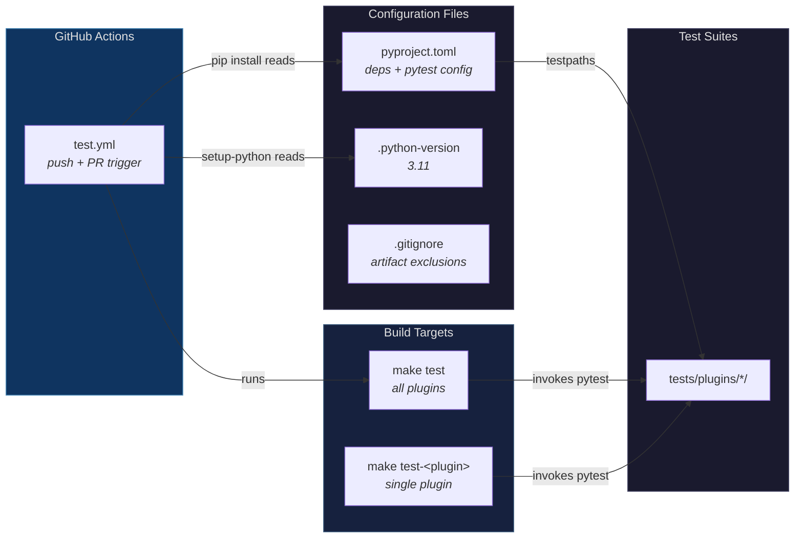
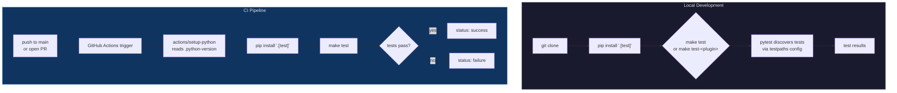

## Context

The project uses pytest for multi-plugin testing, with `pyproject.toml` configuring `testpaths = ["tests/plugins/*"]` to enable automatic test discovery across all plugins. pytest adds each matching directory to `sys.path`, creating potential import collision hazards when multiple plugins contain modules with the same name.

pytest handles `conftest.py` through two mechanisms:

1. **Fixture auto-discovery**: `@pytest.fixture` functions are automatically discovered and scoped to their directory, injected without explicit imports.
2. **Bare Python imports**: Non-fixture functions accessed via `from conftest import func` resolve through Python's standard module system using `sys.path`. When multiple directories contain `conftest.py`, module resolution is ambiguous.

The project uses `addopts = "--import-mode=importlib"` in `[tool.pytest.ini_options]` (importlib mode available since pytest 6.0, within the existing >=7.2.0 requirement) to prevent pytest from adding test directories to `sys.path`. This eliminates bare module name collisions by making them structurally impossible. Under importlib mode, helper functions must be defined in named modules (e.g., `helpers.py`) and exposed through fixture-wrapped interfaces in `conftest.py` using `importlib.util.spec_from_file_location`.

The repo has project-level test infrastructure with `pyproject.toml` declaring test dependencies (`[project.optional-dependencies]` with a `test` group containing pytest and companion libraries), a Makefile with `test` and `test-%` pattern rule targets (e.g., `make test-finite-skill-machine`), `.python-version` pinning Python 3.11, GitHub Actions CI workflow at `.github/workflows/test.yml`, and `.gitignore` entries for Python test artifacts. Tests are located in `tests/plugins/` with pytest configured via `testpaths = ["tests/plugins/*"]` for automatic per-plugin test discovery.

## Objectives

`OBJ-conftest-fixtures-only`: Every `conftest.py` in `tests/plugins/*/` contains exclusively `@pytest.fixture`-decorated functions — no plain helpers, no utility functions, no constants consumed via bare import.

`OBJ-zero-bare-conftest-imports`: Zero `from conftest import` statements exist across all plugin test directories. Verifiable via `grep -r "from conftest import" tests/` returning no matches.

## Architecture

### System Overview

Multi-plugin test infrastructure with pytest configuration, standardized file layout for test helpers, build targets, CI pipeline, and repo hygiene.

**Configuration** (`pyproject.toml`):
```toml
[project.optional-dependencies]
test = [
    "pytest>=7.2.0",
    "pytest-asyncio>=0.23.0",
    "pytest-cov>=5.0.0",
    "pytest-timeout>=2.3.0",
]

[tool.pytest.ini_options]
testpaths = ["tests/plugins/*"]
addopts = "--import-mode=importlib"
asyncio_mode = "auto"
timeout = 30
```

**File layout** (example from `tests/plugins/finite-skill-machine/`):
```
conftest.py
  ├── 14 @pytest.fixture functions
  ├── run_hook fixture       (session-scoped, wraps helpers.run_hook)
  └── make_task_file fixture (session-scoped, wraps helpers._make_task_file)
helpers.py
  ├── run_hook()
  └── _make_task_file()
test_hydrate_tasks.py
  └── run_hook, make_task_file (via fixture injection)
```

### Build/Test Infrastructure



Two independent flows: local development and CI.



### Component Interactions

No complex inter-component interactions for the isolation layer. The architecture is a pytest configuration setting and a module-level organization pattern within plugin test directories. The build/test infrastructure is a set of configuration files consumed by standard tools (pytest, make, GitHub Actions).

## Components

`CMP-pyproject`: pyproject.toml
- **Description**: Project configuration file with pytest settings and test dependency declarations.
- **Responsibilities**: Configure pytest to use importlib-based module resolution via `addopts = "--import-mode=importlib"`. Configure `testpaths = ["tests/plugins/*"]` for automatic per-plugin test discovery (pytest expands wildcard patterns using the glob module). Configure `asyncio_mode = "auto"` for async test support and `timeout = 30` as a default test timeout. Declare `test` optional dependency group with `pytest>=7.2.0` (minimum version required for glob module support in testpaths wildcard expansion), `pytest-asyncio>=0.23.0` (async test support), `pytest-cov>=5.0.0` (coverage reporting), and `pytest-timeout>=2.3.0` (test timeout enforcement). This is the root-cause fix for cross-plugin import collisions.
- **Dependencies**: None (consumed by pip and pytest).

`CMP-helpers`: helpers.py
- **Description**: Named Python module in a plugin test directory containing non-fixture test helper functions. The module name `helpers` avoids pytest's collection patterns (`test_*.py` or `*_test.py`) — pytest will not attempt to collect it as a test module. Under importlib mode, this module cannot be bare-imported; `conftest.py` loads it via `importlib.util.spec_from_file_location` and exposes its functions as fixtures.
- **Responsibilities**: Define helper functions (e.g., `run_hook`, `_make_task_file`) that test files consume via fixture injection. Module name `helpers` is a convention — any name other than `conftest` works, but `helpers` communicates intent.
- **Dependencies**: Varies by plugin. Typical dependencies include `subprocess`, `json`, `os`, `pathlib.Path`.

`CMP-conftest`: conftest.py
- **Description**: pytest auto-discovery file containing exclusively `@pytest.fixture` definitions. Under importlib mode, the conftest-only convention is self-enforcing — non-fixture code in conftest.py cannot be bare-imported because pytest no longer adds the directory to `sys.path`.
- **Responsibilities**: Provide fixtures (e.g., `task_dir`, `skill_dir`, `hydrate_module`) to test files in the same directory. Loads `helpers.py` via `importlib.util.spec_from_file_location` and exposes helper functions as `@pytest.fixture(scope="session")` fixtures returning the callables — this is the bridge between importlib-isolated helper modules and test files.
- **Dependencies**: pytest (for `@pytest.fixture` decorator), `importlib.util` (for loading helper modules).
- **Warning behavior**: `importlib.util.spec_from_file_location` is a standard library function that does not emit warnings during normal module loading. The `-W error` verification flag serves as a catch-all for any unexpected warnings from any source, not specifically from the importlib loading mechanism.

`CMP-makefile`: Makefile
- **Description**: Standard Unix build targets for test execution.
- **Responsibilities**: `test` target runs `pytest` (all configured testpaths). `test-%` pattern rule runs `pytest tests/plugins/$*/` (single plugin, e.g., `make test-finite-skill-machine`). Both targets assume the virtual environment is activated (pytest is on PATH). Current recipes are single-line pytest invocations where exit codes propagate naturally.
- **Dependencies**: pytest (installed via `CMP-pyproject`).

`CMP-python-version`: .python-version
- **Description**: Single-line file pinning the Python version to `3.11`. Consumed by `actions/setup-python` in CI. Compatible with version managers such as `pyenv` (version manager behavior is out of scope — see functional.md).
- **Responsibilities**: Pin the major.minor Python version. Allow tools to auto-resolve the latest patch.
- **Dependencies**: None (consumed by external tools).

`CMP-ci-workflow`: .github/workflows/test.yml
- **Description**: GitHub Actions workflow that runs the test suite on push to `main` and on pull requests.
- **Responsibilities**: Trigger on push (main branch) and pull_request events. Use `actions/checkout` to clone the repo. Use `actions/setup-python` with `python-version-file: '.python-version'` to install the pinned Python version. Install project with test dependencies via `pip install ".[test]"`. Run `make test`. Report pass/fail status to GitHub (merge gating via branch protection is configured separately).
- **Dependencies**: `CMP-pyproject` (for dependency installation), `CMP-python-version` (for Python version), `CMP-makefile` (for test target).

`CMP-gitignore`: .gitignore (modified)
- **Description**: Python/pytest artifact exclusions in the existing `.gitignore`.
- **Responsibilities**: Include `.pytest_cache/`, `*.pyc`, and `.venv/` entries. Entries are additive — duplicates with existing patterns (e.g., `__pycache__/`) are harmless and idempotent. Existing entries are preserved.
- **Dependencies**: None.

`CMP-readme`: README.md (modified)
- **Description**: Testing section in the existing README documenting setup and test execution.
- **Responsibilities**: Document the test environment setup steps (`python -m venv .venv`, `source .venv/bin/activate`, `pip install ".[test]"`). Document available Makefile targets (`make test`, `make test-<plugin>`).
- **Dependencies**: None.

## Interfaces

`INT-run-hook`: run_hook (exposed as session-scoped fixture)
- **Signature**: `run_hook(session_id: str, command_name: str, cwd: str, task_root: str | None = None, plugins_file: str | None = None, user_skills_root: str | None = None) -> tuple[int, str, str]`
- **Purpose**: Execute hook scripts (e.g., hydrate-tasks.py) with JSON stdin, return `(exit_code, stdout, stderr)`. Defined in `helpers.py`; loaded by `conftest.py` via `importlib.util.spec_from_file_location` and exposed as a `@pytest.fixture(scope="session")` that returns the callable. Test files receive `run_hook` via fixture injection.
- **Dependencies**: `subprocess`, `json`, `os`, `pathlib.Path`

`INT-make-task-file`: _make_task_file (exposed as session-scoped fixture)
- **Signature**: `_make_task_file(task_dir: Path, filename: str, content: dict) -> Path`
- **Purpose**: Create a JSON task file in the given directory, return the file path. Defined in `helpers.py`; loaded by `conftest.py` via `importlib.util.spec_from_file_location` and exposed as a `@pytest.fixture(scope="session")` that returns the callable. Test files and conftest.py fixtures receive `_make_task_file` via fixture injection.
- **Dependencies**: `json`, `pathlib.Path`

## Decisions

`[common-test-infra]` In the context of multi-plugin test infrastructure where `testpaths` glob adds all plugin directories to `sys.path`, facing ambiguous `from conftest import` resolution when multiple plugins have `conftest.py`, we decided to adopt importlib mode via `addopts = "--import-mode=importlib"` in `pyproject.toml` and place non-fixture helpers in named modules (e.g., `helpers.py`) with conftest.py loading them via `importlib.util.spec_from_file_location` and exposing their functions as session-scoped fixtures, and neglected restructuring `testpaths` to avoid `sys.path` sharing, introducing a shared test utilities package, or having test files import helpers directly via `importlib.util`, to achieve collision-free imports by eliminating `sys.path`-based module resolution, affecting bare-imported helpers in existing test files, accepting that bare `from conftest import` and `from helpers import` statements fail by design under importlib mode -- all cross-module helper functions must be fixture-wrapped in conftest.py -- and future contributors must follow this convention without automated enforcement.

**Isolation guarantee**: Cross-plugin test isolation is a structural property of importlib mode — pytest no longer adds test directories to `sys.path`, so module name collisions between plugin directories are impossible by configuration. This guarantee holds for both `conftest.py` and named helper modules. Because the isolation is enforced by pytest's import machinery rather than by test infrastructure we build, the requirement scenarios focus on verifying the helper module migration (the change we make) rather than testing pytest's importlib behavior.

`[common-test-infra]` In the context of declaring test dependencies, we decided to use `pyproject.toml` with an optional `[test]` extras group, and not `requirements.txt` or `requirements-dev.txt`, to follow modern Python packaging standards (PEP 621) and consolidate project configuration in one file, accepting that contributors need pip 21.3+ (released Oct 2021).

`[common-test-infra]` In the context of providing test commands, we decided to use a Makefile with `test` and `test-%` pattern rule targets (e.g., `make test-finite-skill-machine`), and not a `scripts/` directory or task runner, to use the most common Unix build tool convention that requires no additional dependencies, accepting that Windows contributors would need Make installed or must run pytest directly.

`[common-test-infra]` In the context of CI Python version strategy, we decided to use a single Python version matching `.python-version`, and not a multi-version matrix, to keep CI simple and fast for a plugin marketplace that targets one runtime, accepting that compatibility issues with other Python versions go undetected.

`[common-test-infra]` In the context of choosing the Python version to pin, we decided to use `3.11`, and not `3.13`, to ensure broad compatibility across CI runners, contributor machines, and OS distributions, accepting that newer Python features (3.12+ syntax, performance improvements) are unavailable.

`[common-test-infra]` In the context of test execution environments, we decided to accept divergent contexts (local venv activation vs CI system Python), and not enforce a single mechanism, to keep both flows simple and conventional, accepting that contributors must activate their venv while CI relies on system-level pip.

`[common-test-infra]` In the context of CI automation, we decided to use GitHub Actions, and not Jenkins/CircleCI/etc., to use the built-in CI for GitHub-hosted repos requiring no external service accounts, accepting vendor lock-in to GitHub's CI platform.

`[common-test-infra]` In the context of plugin-specific test targets, we decided to use explicit pytest path arguments, and not testpaths filtering or `-k` selectors, to provide deterministic single-plugin execution independent of testpaths configuration, accepting that target definitions must be updated when test directories move.

`[common-test-infra]` In the context of test directory structure, we decided to relocate tests from plugin directories to a centralized `tests/plugins/` hierarchy, and not keep them alongside plugin code, to separate test artifacts from distributed plugin code (the marketplace distributes plugin directories; tests should not ship to consumers), accepting that test code must use longer path expressions to reference plugin scripts.

## Risks
