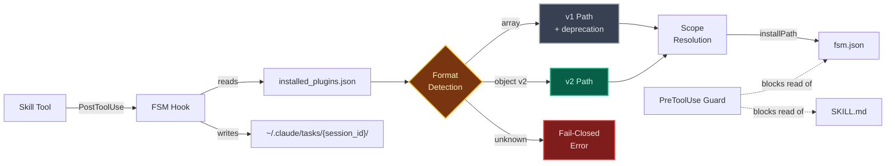
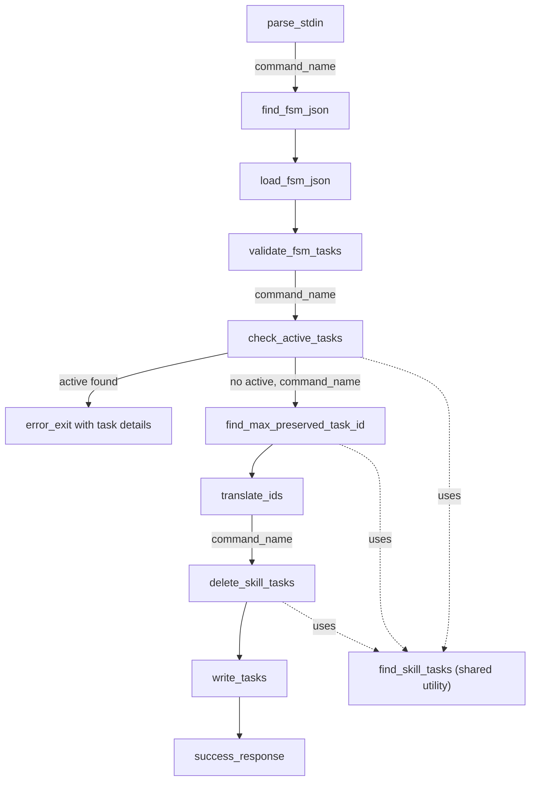

## Context

Claude Code plugin system supports PostToolUse and PreToolUse hooks that execute as child processes. Hooks receive JSON via stdin and communicate via stdout/stderr. The task system stores tasks as individual JSON files in `~/.claude/tasks/{session_id}/`. The plugin targets Python 3 stdlib-only (no external dependencies beyond pytest for testing).

The FSM hook (`hydrate-tasks.py`) resolves plugin install paths from `~/.claude/plugins/installed_plugins.json` via scope precedence (local > project > user). The registry file supports two formats: v1 (flat array) and v2 (versioned object with nested `plugins` dict). Format detection uses root JSON type checking to distinguish between versions.

The `fsm` metadata value (e.g., `"plugin-a:skill-a"`) is semantically meaningful: it identifies which skill owns each task. Task files follow Claude Code's existing file-based task format (JSON with id, subject, description, status, metadata fields). This spec references those fields but does not re-specify the format, which is owned by Claude Code. Task files follow Claude Code's file-based model where deletion removes the file entirely. There is no "deleted" status to encounter — deleted tasks cease to exist as files.

**Malformed task file definition**: A task file is considered malformed if it is not parseable as JSON, OR is missing required fields (`id`, `status`, `metadata`), OR has wrong field types (e.g., non-integer `id`, non-string `status`, non-object `metadata`). All components that read task files apply this definition consistently when enforcing fail-fast behavior for "unreadable or malformed" files.

The chaos-theory repo has project-level test infrastructure documented in `openspec/common/`. Tests are located in `tests/plugins/` with pytest configured via `testpaths = ["tests/plugins/*"]` for automatic per-plugin test discovery.

## Objectives

- `OBJ-auto-hydration`: Automatic task creation from fsm.json companion files when a skill is invoked via the Skill tool
- `OBJ-fail-closed`: Atomic validation — all tasks validated before any writes or deletes occur; errors fail the hook explicitly
- `OBJ-scope-resolution`: Correct skill directory location via installed_plugins.json with scope precedence (local > project > user)
- `OBJ-scoped-delete`: Deletion only affects tasks whose `fsm` metadata value matches the invoking skill's `command_name`
- `OBJ-active-guard`: Hydration aborts before any mutations when the invoking skill's tasks have any status outside the allowlist `{"completed", "pending"}` or have mixed statuses. The guard checks only tasks whose `fsm` metadata value matches the invoking skill's `command_name`. Re-invocation proceeds only when all matching tasks are uniformly `completed` (workflow done) or uniformly `pending` (nothing started). Any other status value — including unrecognized values like `blocked` or `cancelled` — triggers abort. When no tasks match the invoking skill's `command_name`, the guard passes (no tasks to protect).

## Architecture

### Runtime Architecture

#### System Overview



#### Component Interactions

The flowchart ordering is authoritative: validation (`validate_fsm_tasks`) precedes the active task guard (`check_active_tasks`).



#### Re-invocation Sequence

When the active task guard passes (all matching tasks are uniformly completed or uniformly pending, or no matching tasks exist), the hook proceeds through the following pipeline:

1. **Offset calculation** — `find_max_preserved_task_id` scans all task files, excludes those targeted for deletion (matching the invoking skill's `command_name`), and returns the highest preserved task ID.
2. **ID translation** — `translate_ids` offsets local fsm.json IDs by the max preserved ID, including dependency references (`blockedBy`).
3. **Scoped deletion** — `delete_skill_tasks` removes only task files whose `fsm` metadata value matches the invoking skill's `command_name`.
4. **Task writing** — `write_tasks` writes the translated tasks to the task directory.

This is a delete-then-hydrate contract: old tasks are removed before new tasks are written. The flowchart above is authoritative for ordering; this prose confirms the contract.

**Write failure after deletion**: If `write_tasks` fails after `delete_skill_tasks` has already removed old tasks, the skill is left with zero matching tasks. This state is self-recovering under transient failure conditions: re-invoking the skill will find an empty set (guard passes) and perform fresh hydration. Under persistent failure conditions (e.g., disk full, permissions revoked), re-invocation will repeatedly pass the guard and fail to write, requiring manual intervention. The atomic fail-closed contract ("hydration either fully completes or has no effect") applies to the guard-vs-mutation boundary; individual file I/O failures within the mutation phase are recoverable by re-invocation.

Build/test infrastructure (pyproject.toml, Makefile, .python-version, GitHub Actions, .gitignore, README) is defined in `openspec/common/technical.md`.

## Components

`CMP-hydrate-tasks`: hydrate-tasks.py
- **Description**: PostToolUse hook script that hydrates the task list from a skill's fsm.json
- **Responsibilities**: Parse hook stdin, locate skill directory, read and validate fsm.json, translate local IDs to actual IDs, delete stale FSM-tagged tasks, write new task files
- **Dependencies**: Claude Code hook stdin format, installed_plugins.json, task file system at `~/.claude/tasks/`

`CMP-block-skill-internals`: block-skill-internals.sh
- **Description**: PreToolUse guard script that prevents the agent from reading SKILL.md or fsm.json directly
- **Responsibilities**: Intercept Read tool calls targeting skill internal files, return block response
- **Dependencies**: Claude Code PreToolUse hook mechanism

`CMP-fsm-json`: fsm.json companion file
- **Description**: JSON array of task definitions that lives alongside a skill's SKILL.md
- **Responsibilities**: Declare task workflows with local IDs, subjects, descriptions, dependencies, and metadata
- **Dependencies**: None (static file consumed by CMP-hydrate-tasks)

`CMP-format-detector`: Format detection logic (within `load_installed_plugins()`)
- **Description**: Logic path within the existing `load_installed_plugins()` function that detects v1 vs v2 vs unknown registry format from the root JSON structure.
- **Responsibilities**: Parse JSON from `installed_plugins.json`, type-check root value (`list` = v1, `dict` = check `version` field), validate v2 structural requirements (`version` is `2`, `plugins` key exists and is `dict`), emit deprecation notice to stderr for v1 format, call `error_exit()` for unknown formats (object without `version`, unsupported version number, `plugins` not a dict, missing `plugins` key).
- **Dependencies**: `installed_plugins.json` file, `error_exit()` utility, `log()` function for stderr output.

`CMP-plugin-resolver`: Plugin install path resolution (within `find_plugin_install_path()`)
- **Description**: Component that handles both v1 entry lists and v2 plugin-key matching.
- **Responsibilities**:
  - v1 path: match `plugin_name@` prefix against entry `name` fields, apply scope precedence over flat entry list
  - v2 path: iterate v2 `plugins` object keys, split each key on `@`, compare first segment to target plugin name, then apply scope precedence over the matched key's entry array using `cwd_matches_project_path()`
- **Dependencies**: Output of `CMP-format-detector`, `cwd_matches_project_path()`, `parse_command_name()`.

`CMP-active-guard`: check_active_tasks
- **Description**: Function that scans the task directory for tasks matching the invoking skill's `command_name` and checks whether re-invocation is allowed using a status allowlist. Re-invocation proceeds only when all matching tasks have a status in the allowed set `{"completed", "pending"}` AND all share the same status. When no tasks match the invoking skill's `command_name`, the guard passes (empty set — no tasks to protect). Any task with a status outside the allowlist (e.g., `in_progress`, `blocked`, `cancelled`, or any unrecognized value) triggers an abort. Any mix of allowed statuses (e.g., 3 completed + 2 pending) also triggers an abort, as it indicates the workflow is partially complete.
- **Responsibilities**: Read task files, filter by `fsm` value match, collect status set, check each status against the allowlist `{"completed", "pending"}`, determine if all statuses are uniform within the allowlist, format JSON-structured abort error via `error_exit` when any status is outside the allowlist or statuses are mixed. Abort hydration (fail-fast) if any task file is unreadable or malformed (see malformed definition in Context) — a corrupted file could hide an in-progress task and allow re-invocation that destroys work.
- **Abort error format**: JSON object sent to stderr with the following structure:
  ```json
  {
    "tasks": [6, 7],
    "message": "Related active task(s) must be resolved and verified first."
  }
  ```
  The `tasks` array lists each matching task's ID. The agent already has task context and can read task details if needed. The `message` field is a fixed string that never references internal mechanisms (no "hydration", "re-hydration", or similar terms) and never suggests the agent "delete" or "just complete" tasks.
- **Dependencies**: Task directory path, `command_name` from parsed stdin.

`CMP-scoped-find`: find_skill_tasks
- **Description**: Scans task directory for tasks whose `fsm` metadata value matches the invoking skill's `command_name`.
- **Responsibilities**: Scan task directory, read metadata, return only tasks whose `fsm` value equals `command_name`. Abort hydration (fail-fast) if any task file is unreadable or malformed (see malformed definition in Context) — consistent safety policy across all components that read task files.
- **Note on non-string fsm values**: Tasks whose `fsm` metadata value is not a string (e.g., `null`, `""`, `42`) will not match any real skill's `command_name` via string equality. These tasks are treated as belonging to another skill: they are preserved by scoped deletion, included in offset calculations as preserved tasks, and never matched by any scoped operation. No special-case handling is needed — the existing value-match logic handles this correctly by definition.
- **Dependencies**: Task directory path, `command_name` from parsed stdin.

`CMP-scoped-offset`: find_max_preserved_task_id
- **Description**: Scans task files and computes the highest task ID among tasks that will be preserved (those not matching the invoking skill's `command_name`). Tasks from other skills are preserved and must be included in the max ID calculation.
- **Responsibilities**: Scan task files, identify which are targeted for deletion by `command_name`, compute max ID from all non-targeted tasks. Abort hydration (fail-fast) if any task file is unreadable or malformed (see malformed definition in Context) during offset calculation — silently skipping corrupted files could miss high IDs and cause ID collisions.
- **Dependencies**: Task directory path, `command_name` from parsed stdin.

`CMP-scoped-delete`: delete_skill_tasks
- **Description**: Deletes only task files whose `fsm` metadata value matches the invoking skill's `command_name`.
- **Responsibilities**: Delete only tasks matching the invoking skill. On first deletion failure, abort via `error_exit`. File deletion is not transactional — files deleted before the failure are not restored.
- **Dependencies**: `find_skill_tasks` output.

Repo-level components (CMP-pyproject, CMP-makefile, CMP-python-version, CMP-ci-workflow, CMP-gitignore, CMP-readme) are defined in `openspec/common/technical.md`.

## Interfaces

`INT-hook-stdin`: Hook input JSON
- **Input**: JSON object via stdin
  ```json
  {
    "session_id": "uuid",
    "cwd": "/path/to/project",
    "tool_input": { "skill": "my-plugin:my-skill" },
    "tool_response": {
      "success": true,
      "commandName": "my-plugin:my-skill"
    }
  }
  ```
- **Required fields**: `session_id`, `tool_response.commandName`
- **Error**: Exit non-zero if missing or malformed

`INT-fsm-json`: fsm.json schema
- **Input**: JSON array at root level
  ```json
  [
    {
      "id": 1,
      "subject": "Task title",
      "description": "Optional details",
      "activeForm": "Doing the task",
      "status": "pending",
      "blockedBy": [1],
      "blocks": [3],
      "metadata": {"custom": "value"},
      "owner": ""
    }
  ]
  ```
- **Required fields per entry**: `id` (number), `subject` (string)
- **Optional fields**: `description`, `activeForm`, `status`, `blockedBy`, `blocks`, `metadata`, `owner`
- **Validation**: No duplicate IDs, all dependency references must exist in same file

`INT-task-file`: Output task file schema
- **Output**: One JSON file per task at `~/.claude/tasks/{session_id}/{id}.json`
  ```json
  {
    "id": "6",
    "subject": "Set up environment",
    "description": "",
    "activeForm": "",
    "owner": "",
    "status": "pending",
    "blocks": [],
    "blockedBy": ["5"],
    "metadata": { "fsm": "my-plugin:my-skill" }
  }
  ```
- **Key constraints**: `id` is a **string** (not number); `blocks`/`blockedBy` always present as arrays of strings; `metadata` always includes `{"fsm": "skill-name"}`

## Decisions

In the context of multi-skill task interaction, facing the risk of one skill deleting another skill's tasks, we decided on a hybrid FSM tag approach (`{"fsm": "skill-name"}` metadata with key-only deletion), to achieve coexistence of FSM and manual tasks, accepting that all FSM-tagged tasks are reset when any skill with fsm.json is invoked. `[finite-skill-machine]`

In the context of getting task definitions into the hook, facing the discovery that tool_response contains only `{success, commandName, allowedTools}` and not skill content, we decided on a companion fsm.json file approach, to achieve reliable task definition delivery independent of tool response format, accepting an extra file in the skill directory. `[finite-skill-machine]`

In the context of hook error handling, facing the risk of silent failures hiding task creation problems, we decided on explicit fail-closed behavior (exit non-zero on any error), to achieve immediate visibility into task creation issues, accepting that the agent sees hook failure notifications. `[finite-skill-machine]`

In the context of task creation atomicity, facing the risk of partial writes leaving inconsistent state, we decided on validate-all-first ordering (parse + validate all tasks before any deletes or writes), to achieve atomic behavior where either all tasks are created or none are, accepting that validation must complete before any filesystem changes. `[finite-skill-machine]`

In the context of locating a skill's directory from commandName, facing the need to mirror Claude Code's exact skill resolution, we decided on installed_plugins.json resolution with scope precedence (local > project > user), to achieve correct skill matching in multi-scope installations, accepting a dependency on Claude Code's internal file format. `[finite-skill-machine]`

In the context of circular dependency detection, facing implementation complexity for cycle detection in task graphs, we decided not to detect circular dependencies, to achieve implementation simplicity and behavioral consistency with Claude Code's task system (which also does not detect cycles), accepting that circular dependencies will silently create unresolvable blockedBy chains. `[finite-skill-machine]`

In the context of FSM metadata format, facing ambiguity between `{"fsm": true}` and `{"fsm": "skill-name"}`, we decided on `{"fsm": "skill-name"}` with key-only deletion, to achieve future extensibility for per-skill tracking while maintaining simple deletion logic, accepting that the skill-name value is currently unused for scoping. `[finite-skill-machine]`

In the context of task file schema discovery, facing uncertainty about Claude Code's native task file format, we decided to spike and document the exact schema (string IDs, required arrays, metadata object), to achieve correct task file compatibility, accepting the need for explicit type conversion (numeric local IDs to string actual IDs). `[finite-skill-machine]`

In the context of testing strategy, facing no existing test guidance for hook-based plugins, we decided on pytest with tmp_path fixtures and subprocess integration tests, to achieve comprehensive coverage without external dependencies, accepting that integration tests require subprocess execution of the hook script. `[finite-skill-machine]`

In the context of installed_plugins.json being missing vs plugin entry not found, facing the risk of conflating two distinct error scenarios, we decided on fail-closed for missing/malformed file and fallback to non-plugin lookup for missing plugin entry, to achieve correct behavior for both file-level and entry-level failures, accepting the need to clearly document both code paths. `[finite-skill-machine]`

In the context of detecting v1 vs v2 `installed_plugins.json` format, facing the need to distinguish array (v1) from object (v2) at parse time, we decided on root JSON type checking (`isinstance(data, list)` for v1, `isinstance(data, dict)` with `version` field check for v2), to achieve unambiguous format detection without heuristics, accepting that any future format must be object-typed with a distinct integer version value. `[fsm-installed-plugins-v2]`

In the context of matching a plugin name against v2 registry keys, facing the `plugin@marketplace` key format where the plugin name is the portion before `@`, we decided on splitting each key on `@` and comparing the first segment against the target plugin name, to achieve straightforward key matching consistent with the v1 `name.startswith(f"{plugin_name}@")` approach, accepting that a plugin name containing `@` would match incorrectly (not a realistic concern given naming conventions). `[fsm-installed-plugins-v2]`

In the context of integrating v2 parsing with existing scope-precedence logic, facing the choice between scattering format detection across multiple functions vs centralizing it, we decided on centralizing format detection and validation in `load_installed_plugins()` which returns a format-tagged result, allowing `find_plugin_install_path()` to branch on matching logic while reusing scope-precedence code, to achieve a single point of format awareness with minimal downstream changes, accepting that `find_plugin_install_path()` gains a format-conditional branch for key matching. `[fsm-installed-plugins-v2]`

In the context of warning users about v1 format usage, facing the constraint that stdout is reserved for the hook protocol (`{"continue": true}`), we decided on emitting deprecation notices to stderr, to achieve user visibility without interfering with hook communication, accepting that stderr output visibility depends on Claude Code's hook log handling. `[fsm-installed-plugins-v2]`

In the context of the FSM hook needing to scope deletion, we decided to filter by `fsm` metadata value match against `command_name`, and not by introducing a separate scope field or per-skill directories, to leverage the existing metadata structure that already stores the skill name, accepting that tasks created before this change will have correct values and require no migration. `[fsm-anti-clobber]`

In the context of re-invocation with active tasks, we decided to abort the entire hydration (no deletes, no writes) when the invoking skill's tasks have mixed statuses, and not to skip active tasks and replace only pending ones, to keep the atomic fail-closed contract where hydration either fully completes or has no effect, accepting that users must resolve tasks to a uniform state before re-invoking. `[fsm-anti-clobber]`

In the context of determining which task states block re-invocation, we decided to check for uniform status across all matching tasks (all completed or all pending allows re-invocation), and not to check only individual in_progress status, to protect partially-completed workflows where a mix of statuses (e.g., 3 completed + 2 pending) implies the work as a whole is in progress, accepting that the agent must resolve all tasks to a uniform terminal state before re-invoking. `[fsm-anti-clobber]`

In the context of validating task statuses during the active guard check, we decided to use an explicit allowlist of permitted statuses (`completed`, `pending`) rather than only checking for status uniformity, and not to treat any uniform status as valid for re-invocation, to ensure that unrecognized status values (e.g., `blocked`, `cancelled`) trigger an abort rather than silently allowing re-invocation, accepting that the allowlist must be updated if Claude Code introduces new terminal statuses that should permit re-invocation. `[fsm-anti-clobber]`

In the context of naming the modified functions, we decided to rename `find_fsm_tagged_tasks` → `find_skill_tasks`, `find_max_non_fsm_task_id` → `find_max_preserved_task_id`, and `delete_fsm_tasks` → `delete_skill_tasks`, and not to keep the old names with new parameters, to make the function signatures honest about what they now do, accepting a small diff footprint increase from the renames. `[fsm-anti-clobber]`

Test infrastructure decisions (dependency management, build targets, CI strategy, Python version pinning, test directory structure) are documented in `openspec/common/technical.md` under `[common-test-infra]`.

## Risks

- `installed_plugins.json` format may change without notice — requires hook updates
- Partial write failure after deletion leaves orphaned state — manual recovery required at `~/.claude/tasks/{session_id}/`
- [v2 format may change again] → The v2 format is an internal Claude Code file with no stability guarantee. The format detection logic is structured to fail-closed on unknown formats with an actionable error message, so future format changes produce a clear diagnostic rather than silent failure.
- [Multiple marketplace keys matching the same plugin name] → If a user has `my-plugin@marketplace-a` and `my-plugin@marketplace-b` in their v2 registry, the `@`-split matching will match both keys and use the first found (dict iteration order). This scenario is unlikely given current Claude Code behavior (one marketplace per plugin name), and scope-precedence logic within matched entries provides deterministic selection.
- [Active guard creates a hard stop for skill development iteration] → The abort message will include specific task IDs, giving the agent a clear resolution path. The guard triggers when the skill's tasks have mixed statuses or any status outside the allowlist `{"completed", "pending"}` (indicating the workflow is partially complete or in an unrecognized state). Re-invocation is allowed when all tasks are uniformly completed (workflow done) or uniformly pending (nothing started). Rapid re-invocation before the agent touches any tasks works fine since all tasks remain uniformly pending.
Test infrastructure risks (monorepo cross-contamination) are documented in `openspec/common/functional.md` Known Risks.
