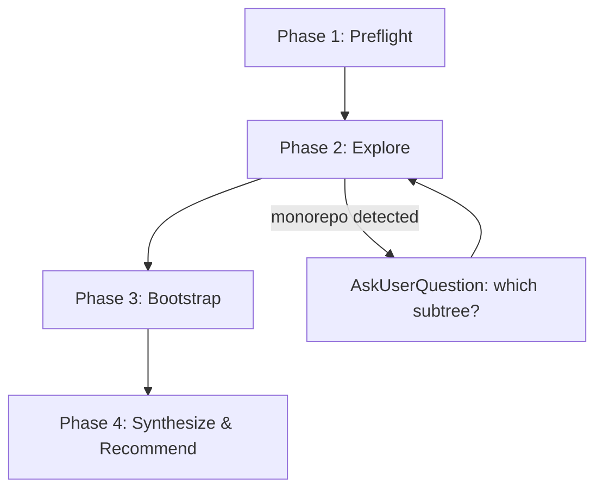

# Brownfield Onboarding

Bootstrap OpenSpec + chaos-theory brownfield into a repo, explore the codebase, and prepare for artifact creation.

## Brownfield Principles

You MUST internalize these before doing any brownfield work. Agents consistently get these wrong.

**1. Code is ground truth.** Document what IS, not what should be. Never prescribe what code should do — describe what it does.

**2. Requirements are NOT unit test mappings.** Requirements are user-facing capability scenarios (Given/When/Then at the system boundary) — what an actor can do and observe. Internal behaviors (retry logic, caching, error handling internals) belong in `technical.md` as component behaviors.

**3. Interview, don't interrogate.** Explore code first, propose what you found, ask the user to confirm/correct. Don't ask the user to describe the system from scratch.

**4. Artifact purposes:**

| Artifact | What it captures |
|----------|-----------------|
| `functional.md` | Why this project exists, what capabilities it has, who it serves |
| `technical.md` | How it's built: components, interfaces, architecture decisions (Y-statements) |
| `infra.md` | How it deploys, tests, and is observed in production |
| `requirements/*.feature.md` | What an actor can do and observe, one file per capability |
| `integration.feature.md` | Cross-capability interactions (optional) |

**5. Artifact order:** functional → technical → infra → requirements → integration. Each depends on prior artifacts.

## Workflow



Follow each phase in order. Do not skip phases. Do not enter plan mode — this is a direct procedure.

## Phase 1: Preflight

Check current state and report what's present or missing:

1. Is the `openspec` CLI available? (`which openspec`)
2. Does an `openspec/` directory exist in the project root?
3. Is the `chaos-theory-brownfield` schema installed? (`openspec schema which chaos-theory-brownfield`)
4. Is there an existing brownfield change in `openspec/changes/`?

Report findings before proceeding.

- If the `openspec` CLI is not available, stop and tell the user: "Install OpenSpec first: `npm install -g openspec`"
- If a brownfield change already exists, ask the user: resume existing or create new?

## Phase 2: Explore

Dispatch **all 5** explore subagents in a **single message** with `model: "sonnet"`. Each subagent should do a `very thorough` exploration.

Subagent 1 detects the repo layout (standalone/monorepo/polyrepo). If monorepo: after exploration completes, use `AskUserQuestion` to ask which subtree to document before proceeding to Phase 3.

**Subagent 1 — Purpose & Structure:**
> What does this project do? Determine the repository layout: standalone project, monorepo with multiple packages/services, or one repo in a larger polyrepo system. Look for workspace configs, multiple service directories, or references to sibling repositories. Find the primary entry point(s) and trace the main execution path. Identify the top-level organizational structure (modules, packages, layers). Check README, CLI help text, main/index files, and route definitions. Return: repo layout type, project purpose (1 sentence), entry points, module map, and primary execution flow. If monorepo, identify which subtree is the target project.

**Subagent 2 — Dependencies & Build:**
> What are this project's runtime and development dependencies? How is it built, packaged, and deployed? Check package manifests (package.json, requirements.txt, Cargo.toml, go.mod, pyproject.toml, etc.), build configs, Dockerfiles, IaC files (Terraform, CDK, CloudFormation, SAM), and CI/CD pipelines. Return: dependency list with purposes, build/deploy pipeline, and infrastructure footprint.

**Subagent 3 — Testing & Quality:**
> What testing frameworks and patterns does this project use? Find test directories, test files, fixtures, and test configuration. Identify the testing strategy: unit, integration, E2E, property-based, etc. Look at CI test commands. Return: test framework, test file locations, testing patterns used, and approximate scope of coverage.

**Subagent 4 — Interfaces & Data Flow:**
> What are this project's external interfaces — APIs, CLI commands, event handlers, UI routes, message queues? How does data enter, flow through, and exit the system? Identify the core domain model (data structures, schemas, types). Return: external interface inventory, data flow summary, and core domain types.

**Subagent 5 — Existing Documentation:**
> Find all existing documentation in this project — README files, wikis, doc directories, inline doc comments, API specs (OpenAPI/Swagger), architecture decision records, changelogs, contributing guides, runbooks, and any other prose that describes the system. Also check for generated docs (JSDoc, Sphinx, rustdoc output). Return: inventory of all documentation files with a brief summary of what each covers and how current it appears to be.

## Phase 3: Bootstrap

Based on preflight results, run only what's needed. Exploration findings inform these steps.

**If no `openspec/` directory:**
```bash
openspec init --tools claude
```

**If no chaos-theory schemas:**
Invoke `tokamak:init-schemas` to copy bundled schemas into `openspec/schemas/`. When init-schemas completes, return here — do not follow any other skill workflows it may suggest.

**Create the brownfield change:**
Invoke `tokamak:new-change` with these pre-selected values:
- Schema: `chaos-theory-brownfield` (do not ask greenfield vs brownfield — this skill is brownfield)
- Project: use the project name identified during exploration
- Triage policy: ask the user their preference (default/conservative/confident/autonomous)
- Gap tracking: initialize gaps.md + resolved.md

When new-change completes (change directory created, triage policy set, gap files initialized), **return here to Phase 4**. Do not proceed to artifact creation.

## Phase 4: Synthesize & Recommend

Review all 5 subagent findings and present an orientation summary to the user:

- **Project purpose** — one sentence
- **Repo layout** — standalone / monorepo (which subtree) / polyrepo
- **Key components** — the major modules, services, or layers identified
- **Existing documentation** — what docs exist and what they cover
- **Concerns or ambiguities** — anything unclear that will need user input during artifact creation

Then recommend the next step to the user (do not auto-invoke):

> The project is bootstrapped for brownfield documentation. Restart the session so the new OpenSpec commands are available, then run `/opsx:continue` to start creating artifacts — beginning with `functional.md`. The brownfield schema will guide you through each artifact with code exploration and user interview.

This skill's job is done after presenting the recommendation. Artifact creation is a separate workflow — it requires a session restart because `openspec init` installs slash commands that aren't picked up mid-session.

## Common Mistakes

| Mistake | Correction |
|---------|-----------|
| Mapping unit tests to requirements | Requirements are user-facing capabilities at system boundary. Unit test details go in `technical.md`. |
| Describing what code *should* do | Describe what code *does*. Code is ground truth. |
| Asking user to describe the system | Explore code first, propose findings, let user correct. |
| Loading skills to learn about OpenSpec/schemas | This skill embeds what you need. Don't load critique, resolve, or writing skills to self-teach. |
| Invoking new-change/init-schemas and not returning | These are subroutines. When they complete, return to the next phase in this skill. |
| Listing files-to-read as a plan step | Explore subagents handle file discovery. Don't pre-plan which files to read. |
| Entering plan mode for bootstrap steps | This is a direct procedure, not a plan. Execute phases sequentially without plan mode. |
